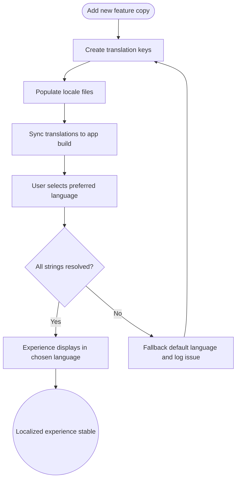

import FeatureSummary from '@site/src/components/FeatureSummary';

# Localization Management (Keys & Translations)

## Summary

<FeatureSummary />

## Narrative
Localization Management makes AWATERRA feel native in every supported language. Teams maintain a shared registry of translation keys and keep locale files in sync.

Runtime language switching and validation update text, layouts, and assets instantly when a user changes preferences. Clear fallbacks and monitoring catch missing keys before anyone notices in production.

For release 0.1 we focus on English and Russian while collecting user feedback to decide the next wave of locales for 0.2. Processes and tooling still scale so additional languages plug in without rework once priorities land.

## Interaction
1. Define canonical translation keys for product surfaces inside the central repository.
2. Populate locale files with approved translations and store them in version controlled storage.
3. Integrate the i18n service with the app shell so it loads language packs on boot.
4. Expose settings controls for language selection and persist the choice to user preferences.
5. Render screens in the selected language and validate dynamic content for text expansion.
6. Run automated audits that detect missing keys, RTL regressions, or stale translations before release.

:::caution Edge Case
A new build ships without translated copy for a key. The fallback should show the default language and log the gap for fast remediation.
:::

:::tip Signals of Success
- Users change language without relaunching and keep their active session.
- Translation completeness stays at or above 98 percent across supported locales.
- Automated audits report zero critical missing key or RTL issues for launch builds.
:::

### Journey

## Requirements
- **Acceptance criteria**
  - GIVEN a supported language WHEN the user switches preferences THEN all navigation, system copy, and dynamic strings update instantly without reload.
  - GIVEN new translation keys WHEN build validation runs THEN missing or outdated translations are flagged and cannot pass without review.
  - GIVEN an RTL locale WHEN the app renders THEN layouts, typography, and input affordances mirror correctly.
  - GIVEN the 0.1 launch WHEN users choose English or Russian THEN the experience loads the correct locale pack, records feedback requests, and queues demand metrics for 0.2 planning.
- **No-gos & risks**
  - Do not allow hard coded strings in the product surfaces.
  - Avoid releasing locales without proofread translations and QA sign off.
  - Prevent silent fallback failures that hide missing translations from analytics.

## Data
- Primary metric: Translation coverage per locale (target 98 percent or higher each sprint).
- Secondary checks: Average language switch latency under 800 milliseconds, count of missing key alerts per release train.
- Telemetry requirements: Log language change events, missing key incidents, locale-specific errors, and requests for additional languages to steer 0.2 planning.

## Future Considerations
- Monitor English and Russian usage plus feedback to prioritize additional locales for release 0.2.
- Define how dynamic content translations from community or partner feeds enter the localization pipeline without blocking releases.
- Evaluate whether in-product copy review workflows are required for regulated regions before scaling beyond the initial languages.
