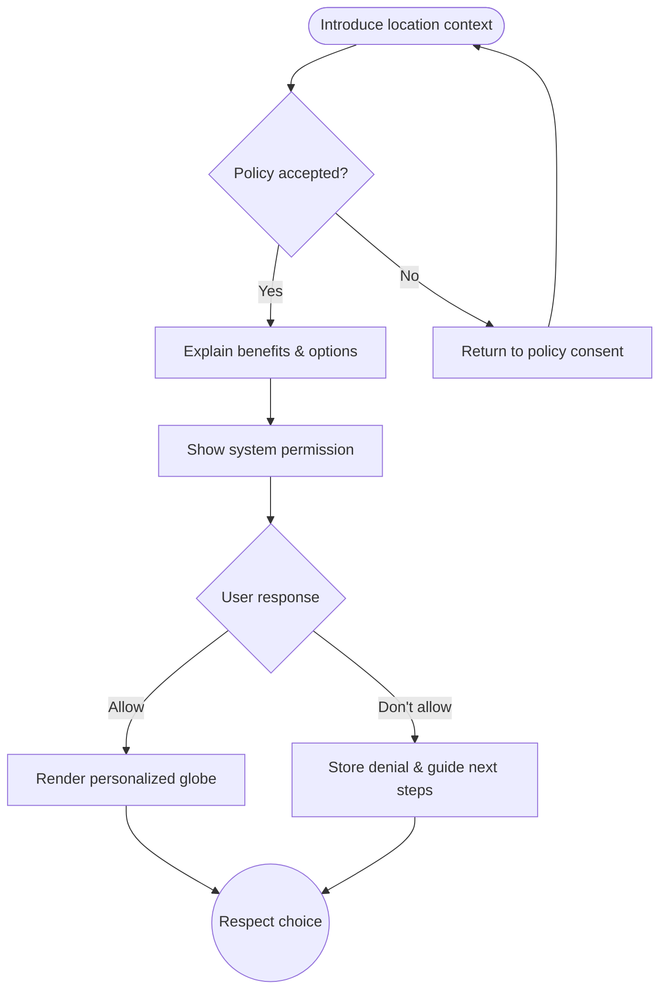

import FeatureSummary from '@site/src/components/FeatureSummary';

# Location Permission During Onboarding

## One-Glance Summary

<FeatureSummary />

## Narrative
Location permission unlocks the personal resonance of the Light Map. During onboarding we explain why sharing a general location matters and acknowledge privacy choices in plain language.

The screen pairs clear copy with a globe preview so users see the benefit before the system modal appears. If they decline we honor the decision and show how to enable it later without friction.

## Interaction Blueprint
1. Confirm user acceptance of the data policy before requesting location.
2. Present contextual education: why location helps, how data is protected, and what happens if they decline.
3. Offer primary and secondary actions (Allow, Not Now) with equal respect.
4. Trigger the system permission prompt only after the user opts in.
5. Handle responses: success leads to globe personalization; denial stores preference and offers gentle re-entry points.
6. Log consent state and provide in-app settings to revisit the decision.

:::caution Edge Case
Device-level restrictions prevent location even after consent. Show a clear message and link to OS instructions.
:::

:::tip Signals of Success
- Acceptance rate stays high with positive feedback about clarity.
- Users who defer can enable later without dead ends.
- No crashes or blocked transitions occur when permissions are denied.
:::

### Journey

## Requirements & Guardrails
- **Acceptance criteria**
  - GIVEN a user reaches this step WHEN detail copy renders THEN it references the privacy commitment and optional nature of sharing.
  - GIVEN permission approval WHEN the globe loads THEN coordinates display safely (obfuscated as needed) with no blocking errors.
  - GIVEN a denial WHEN we store the preference THEN the app surfaces pathways to enable later via settings.
- **No-gos & risks**
  - Requesting location before policy consent violates regulation and trust.
  - Pressure tactics or dark patterns that push users to allow sharing.
  - Showing precise coordinates instead of community-safe approximations.

## Data & Measurement
- Primary metric: Permission acceptance rate during onboarding.
- Secondary checks: Percentage of denials that later convert to allow, and support tickets related to location confusion.
- Telemetry requirements: Log consent state, system prompt outcome, and subsequent changes in settings.

## Open Questions
- Should we vary messaging for users who already skipped once versus first-time viewers?
- How granular should the displayed location be to balance personalization with privacy?
