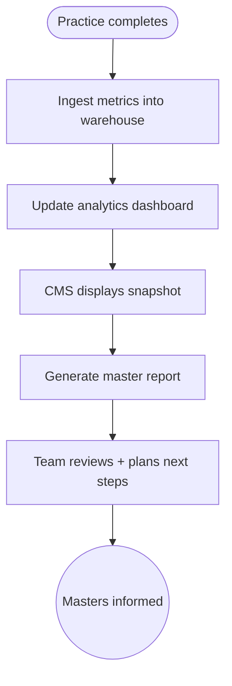

import FeatureSummary from '@site/src/components/FeatureSummary';

# Master Analytics v0.3

## Summary

<FeatureSummary />

## Narrative
Master Analytics wraps all the new telemetry into actionable insight. The pipeline ingests attendance totals, language splits, reaction distribution, gratitude messages, and replay counts. Internal dashboards (Looker/Metabase) surface a timeline per master so the product and content teams can monitor engagement. For external sharing, the CMS "Share report" button generates a PDF/HTML summary the team emails to the master—"247 participants from 12 countries, dominant feeling: Unity, top gratitude themes."

The dashboard also flags anomalies: low attendance, high drop-off, muted reaction rates. Filters allow slicing by language, time of day, and whether the session was live or replay. Data definitions stay consistent with existing analytics (Practices Reactions Base) so cross-version comparisons remain valid. All exports remain de-identified—no personal notes leave the platform without consent.

## Interaction
1. Practice completes; ingestion job collects attendance, reaction totals, gratitude submissions, AU generated, and device mix.
2. Data lands in warehouse (BigQuery/Firestore) tagged by master, language, version.
3. Dashboard refreshes within 15 minutes, showing time series and per-session cards.
4. Operations opens the session in CMS, views the analytics snapshot, and clicks "Share report" to generate partner-friendly summary.
5. Optional CSV/JSON export supports deeper analysis or archiving.
6. Insights feed roadmap decisions (e.g., commission more EN tracks where demand is high).

:::caution Edge Case
Respect privacy—gratitude messages should be summarised or anonymised before inclusion in outbound reports.
:::

:::tip Signals of Success
- Masters receive timely, digestible recaps that strengthen partnership trust.
- Internal teams can quickly spot which masters or time slots drive the most engagement.
- Reaction anomalies trigger follow-up investigations before the next collective.
:::

### Journey

## Requirements
- **Acceptance criteria**
  - GIVEN a master session ends WHEN ingestion runs THEN dashboards update within 15 minutes with attendance, reactions, and AU metrics.
  - GIVEN operations generates a report WHEN triggered THEN the export includes counts, dominant reactions, language distribution, gratitude themes, and upcoming schedule.
  - GIVEN privacy constraints WHEN gratitude quotes are included THEN they are anonymised or consent-approved before sharing.
- **No-gos & risks**
  - Mixing personal identifiers into exports without consent.
  - Data delays that make reports stale by the time the team emails masters.
  - Divergent metrics between analytics and what users saw on recap screens.
- **Data**
  - Log ingestion latency, report generation runs, master open rates, and follow-up actions driven by insights.

## Open Questions
- Should masters eventually access a self-serve analytics portal, or do we keep reports curated by the internal team?
- How granular should sentiment analysis of gratitude messages be in v0.3?
- Do we correlate attendance with marketing touchpoints (push vs story view) now or in later versions?
