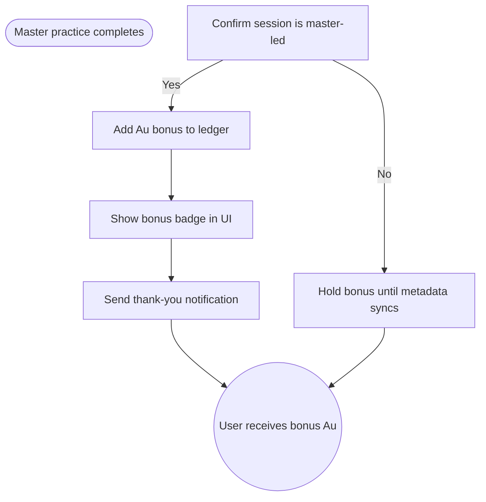

import FeatureSummary from '@site/src/components/FeatureSummary';

# Get Master Au (Lumens)

## Summary

<FeatureSummary />

## Narrative
Master-led practices deserve special recognition. This feature grants an extra Au bonus when a user completes a master session, calling attention to the deeper impact of guided practice.

A dedicated notification thanks the user, explains the bonus, and invites them to continue supporting that master or explore others.

## Interaction
1. User completes a master-led session and the app records the result.
2. Backend tags the session as master-qualified and requests the Au bonus addition.
3. Ledger increments the user's balance with the extra Au and stores the transaction reason.
4. UI displays a distinctive badge showing the bonus amount alongside the regular units earned.
5. In-app notification congratulates the user and optionally links to tipping or following that master.
6. Activity history logs the event so users can revisit the bonus later.
7. If enabled, push notifications echo the reward to prompt re-engagement.

:::caution Edge Case
If the session cannot be verified as master-led (e.g., metadata missing), defer the bonus, show a neutral message, and retry once metadata syncs instead of issuing duplicates.
:::

:::tip Signals of Success
- Users notice and appreciate the master-specific bonus.
- Bonus transactions reconcile cleanly in the ledger.
- Masters see increased follow or tip actions after bonuses appear.
:::

## Journey

## Requirements
- **Acceptance criteria**
  - GIVEN a practice is tagged as master-led WHEN completion posts THEN the ledger logs a bonus transaction with the correct reason code.
  - GIVEN the master metadata is missing WHEN the user finishes THEN the UI communicates that the bonus will post shortly rather than silently skipping it.
  - GIVEN the notification fires WHEN the user taps it THEN they land on a master profile or tip flow with the bonus already reflected.
- **No-gos & risks**
  - Double-counting bonuses inflates currency supply.
  - Delivering notifications without the actual bonus showing yet confuses users.
  - Forgetting to attribute bonuses to specific masters makes analysis harder.

## Data
- **Primary metric:** Percentage of eligible master sessions that issue bonuses successfully.
- **Secondary checks:** Notification open rate, incremental tipping/follow behavior, reconciliation accuracy, and retry volume.
- **Telemetry requirements:** Log session ID, master ID, bonus amount, ledger transaction ID, notification delivery/open, CTA taps, and retry events.

## Open Questions
- Should the bonus amount vary by master tier or remain flat for all guided sessions in 0.4?
- Do we allow users to opt out of master bonus notifications?
