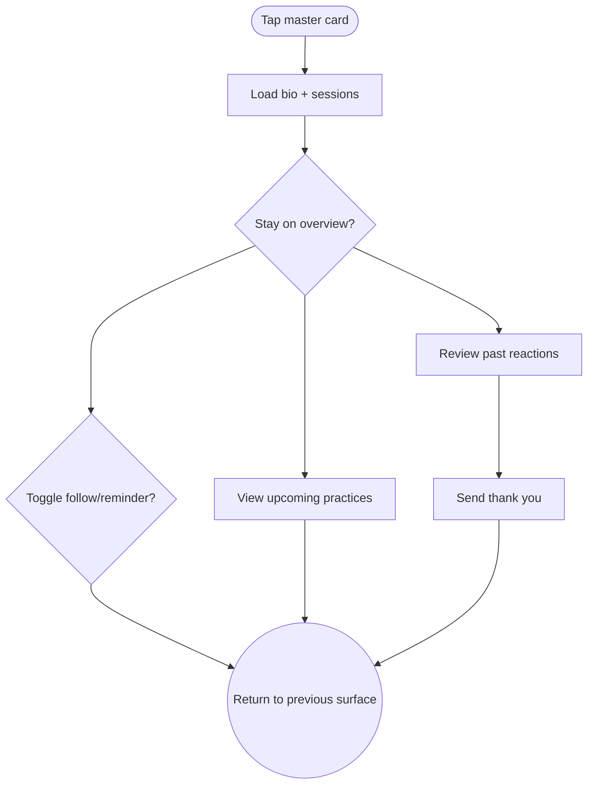

import FeatureSummary from '@site/src/components/FeatureSummary';

# Master Card v0.3 (Bio & Follow)

## Summary

<FeatureSummary />

## Narrative
Master cards now anchor everything about a guide: planet artwork, affirmation, language availability, and social links all live in the Overview tab, matching the visuals from [Home View orbs](/docs/features/home-view-v0-3-masters.md). Follow/reminder toggles float near the top so actions feel immediate yet calm.

Practices + History tabs reuse catalogue data and the reactions timeline to show upcoming collectives and the user’s past feelings with that master. A “Send gratitude” button feeds [Master Analytics](/docs/features/master-analytics-v0-3.md), keeping the partnership loop tight.

## Interaction
1. User opens the card; data loads biography, upcoming sessions, languages, and reaction stats.
2. Overview tab displays story, affirmation, languages, and external links.
3. Practices tab shows upcoming collectives with "Set reminder" and "Add to calendar" controls.
4. History tab plots the user’s past reactions with this master, showing mood shifts and highlights.
5. Follow toggle updates instantly; if on, the master appears in profile carousel and notifications stay active.
6. Gratitude button opens a modal to send a thank-you message; logs to Master Analytics.

:::caution Edge Case
Ensure external links open in a safe web view and warn when leaving the app—avoid jarring context switches.
:::

:::tip Signals of Success
- Users follow masters directly after reading bios, increasing repeat attendance.
- Gratitude messages flow naturally from this surface without requiring navigation elsewhere.
- Language availability makes it obvious whether users will understand the session.
:::

### Journey

## Requirements
- **Acceptance criteria**
  - GIVEN the master card opens WHEN data loads THEN the Overview tab displays biography, affirmation, languages, and social links pulled from CMS.
  - GIVEN the user follows or unfollows the master WHEN toggled THEN the state updates everywhere (Profile carousel, notifications) without delay.
  - GIVEN the user views the History tab WHEN they have past sessions THEN reactions are summarised with before/after context and link to full history timeline.
- **No-gos & risks**
  - Overly long bios that overwhelm the calm layout; enforce character counts and truncation with "Read more." 
  - Sharing personal data or contact details that the master did not approve.
  - Links that break out of the app unexpectedly.
## Data
- **Primary metric:** Follow conversions and reminder toggles triggered inside the card.
- **Secondary checks:** Tab dwell distribution (Overview/Practices/History), gratitude submissions, and deep links into sessions.
- **Telemetry requirements:** Log card entry source, tab switches, follow/reminder state changes, gratitude payloads, and CTA taps with master IDs.

## Open Questions
- Do we allow users to submit questions for masters directly from this card, or keep communication one-way for now?
- Should gratitude messages be private or optionally public for community inspiration?
- How do we display paid offerings if masters later provide subscription content?
