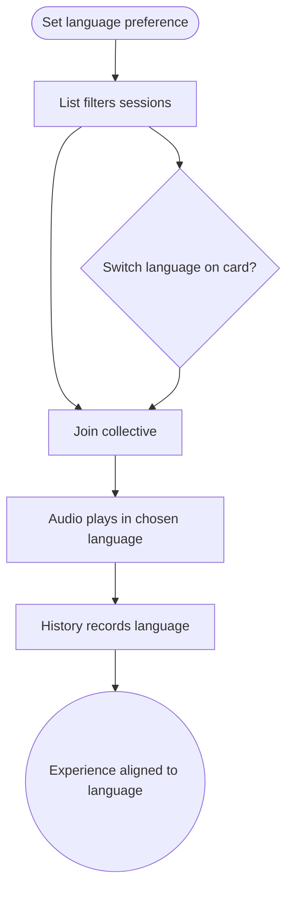

import FeatureSummary from '@site/src/components/FeatureSummary';

# Master Practice Language v0.3

## Summary

<FeatureSummary />

## Narrative
With masters joining from multiple regions, language preference becomes essential. Users can now set preferred languages (e.g., RU, EN) from profile settings; the practice list immediately respects those filters. If a collective supports several languages, the master card shows toggle chips—selecting RU ensures reminders, countdown copy, and audio cues use the Russian track. The FAB reaction labels also localise accordingly.

When no session matches the chosen language, the UI gently offers "Show all languages" to avoid dead ends. Reminders inherit the language choice so pushes arrive in the correct language and deep-link to the right audio file. Admins specify available languages within the CMS, and the system validates that audio assets exist before exposing the option.

## Interaction
1. User sets preferred languages in profile or toggles filters in Practice List.
2. Catalogue refreshes to show only master sessions with matching audio tracks; others appear grayed with option to reveal.
3. On master cards, language chips let users switch tracks; selection persists for reminders and replays.
4. When joining a collective, the Practice Screen loads the chosen audio track and localised copy.
5. Reminders and pushes respect the same language; if the user changes preference later, future reminders adjust.
6. History entries reference the language used to help analytics understand demand.

:::caution Edge Case
If a language asset fails to load, fall back to the user’s next preferred language and inform them calmly—never play the wrong language without notice.
:::

:::tip Signals of Success
- Users rarely encounter sessions in unexpected languages.
- Analytics can report language demand, guiding which tracks to commission next.
- Reminders and story copy always match the audio they will hear.
:::

### Journey

## Requirements
- **Acceptance criteria**
  - GIVEN the user selects preferred languages WHEN viewing the practice list THEN only sessions supporting those languages appear by default.
  - GIVEN a master provides multiple language tracks WHEN the user toggles the chip THEN reminders, pushes, and playback use the selected track.
  - GIVEN language assets are missing WHEN a user requests that language THEN the UI offers alternatives and records the demand event for follow-up.
- **No-gos & risks**
  - Defaulting to the wrong language and eroding trust.
  - Allowing admins to publish language variants without uploading corresponding audio.
  - Over-complicating the UI with too many chips—limit to available languages.
## Data
- **Primary metric:** Percentage of sessions launched in a preferred language (per user).
- **Secondary checks:** Filter/toggle usage, fallback frequency, reminder language changes, and replay demand by language.
- **Telemetry requirements:** Log profile preference changes, filter states, chosen language per join, fallback events, and push language payloads.

## Open Questions
- Should we auto-suggest a second language based on device locale if the preferred language lacks sessions?
- Do we let users subscribe to "notify me when English track available" for masters that currently offer only Russian?
- How do we handle bilingual sessions (one audio track with two languages) in reporting?
