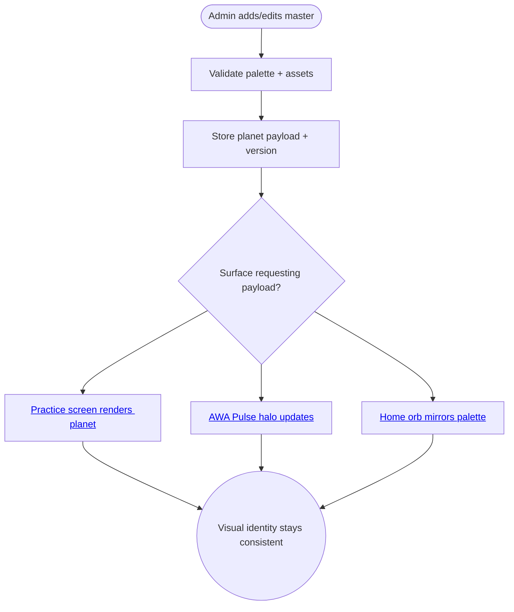

import FeatureSummary from '@site/src/components/FeatureSummary';

# Master's Globe / Planet / Soul

## Summary

<FeatureSummary />

## Narrative
This feature is the source-of-truth for every master’s visual “planet.” Content ops capture colours, glyphs, hero textures, affirmations, and animation parameters inside the CMS; the payload is versioned so the [Practice Screen (Masters)](/docs/features/practice-screen-masters-v0-3.md) and [Master Visualization Screen](/docs/features/master-visualization-screen-v0-3.md) can render the same calm sphere without bespoke code.

The same schema powers [Home View orbs](/docs/features/home-view-v0-3-masters.md), [AWA Pulse halos](/docs/features/awa-pulse-master-collective-v0-3.md), and master cards. Updating a colour or affirmation once ripples everywhere, keeping the collective story coherent while freeing engineering from duplicated assets.

## Interaction
1. Ops create or edit a master inside [Admin Area CMS v0.3](/docs/features/admin-area-cms-v0-3.md); the form captures palette, glyph, planet texture, audio tag, and affirmation.
2. CMS validates required assets (hi-res PNG, animation tokens) and saves a new planet version.
3. Practice catalogue, Home View, and push templates request the planet payload when rendering cards/rings.
4. Visualization screens stream the payload to build countdown scenes and live planets.
5. After the session, recap modules reuse the same palette for stats and thank-you prompts.
6. Deprecating or updating a planet increments the version so cached clients know when to refresh.

### Journey

## Requirements
- **Acceptance criteria**
  - GIVEN a master record WHEN the planet form is completed THEN the CMS stores palette, glyphs, animations, and affirmation with version metadata.
  - GIVEN a client requests a planet payload WHEN the master’s version changes THEN the API returns the updated payload plus cache headers so visuals refresh consistently.
  - GIVEN an asset is missing or corrupt WHEN publishing THEN validation blocks the change with human-friendly errors and audit logs.
- **No-gos & risks**
  - Storing visual assets across multiple systems—keep a single payload to avoid drift.
  - Publishing palettes without accessibility checks (contrast, flashing).
  - Heavy textures that break performance on low-end devices; enforce size limits and fallback colours.

## Data
- **Primary metric:** Time from master profile edit to propagated visuals across Home/Pulse/Practice (should align with CDN cache refresh SLA).
- **Secondary checks:** Validation failure rate, asset download errors, payload version mismatches, and number of rollbacks.
- **Telemetry requirements:** Log payload versions served, asset fetch success/failure, visual cache hits, validation error reasons, and rollback events.

## Open Questions
- Do we allow seasonal/temporary planet skins, and if so how do we sunset them without bloating storage?
- Should masters preview their planet in-app before publish, or is CMS preview sufficient for v0.3?
- Do we expose a lightweight palette-only endpoint for push templates to reduce payload size?
