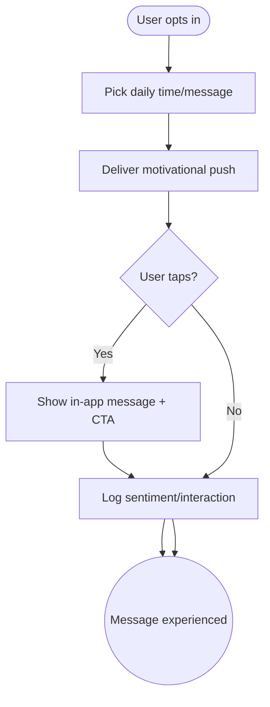

import FeatureSummary from '@site/src/components/FeatureSummary';

# Motivational Message

## Summary

<FeatureSummary />

## Narrative
Motivational Messages keep members inspired between practices. Once per day—either at a user-selected time or a slow moment the system detects—we send a short phrase (“Your light is steady today”) with optional tap-through to a curated suggestion. Tone stays gentle, aligning with AWATERRA’s brand.

## Interaction
1. User opts into motivational messages and sets preferred time or allows smart scheduling.
2. Scheduler chooses the day’s phrase from localized templates.
3. Push notification delivers the message; tapping opens an in-app card with extended copy, recommended practice, or saved quote.
4. Users can dismiss or save the message to their journal.
5. Delivery cadence adapts based on engagement; frequent dismissals may reduce frequency.
6. Users manage settings within Notifications preferences.
7. Analytics monitor sentiment and engagement.

:::caution Edge Case
If a message queue runs out of localized copy, do not fallback to English; delay send and flag the gap so the content team can add translations.
:::

:::tip Signals of Success
- Users feel encouraged rather than spammed; opt-in retention stays high.
- Messages drive gentle re-engagement with practices or reflections.
- Content stays fresh via rotating libraries.
:::

## Journey

## Requirements
- **Acceptance criteria**
  - GIVEN the user enables the feature WHEN the scheduled time arrives THEN they receive a localized motivational push with preview text.
  - GIVEN they tap the push WHEN the card opens THEN the full message appears with optional CTA (practice, journal, share).
  - GIVEN they disable motivational messages WHEN settings update THEN no further pushes send until re-enabled.
- **No-gos & risks**
  - Reusing the same phrases quickly feels inauthentic; maintain a robust library.
  - Sending during quiet hours may feel intrusive; respect user settings.
  - Avoid overly prescriptive advice; keep copy gentle and inclusive.

## Data
- **Primary metric:** Daily active opt-ins (users receiving messages).
- **Secondary checks:** Tap-through rate, saves-to-journal, opt-out rate, locale coverage, and adaptive cadence changes.
- **Telemetry requirements:** Log message ID, send time, locale, tap events, CTA usage, opt-in/out actions, and skipped sends due to missing translations.

## Open Questions
- Should users be able to “favorite” phrases for future reference?
- Do we experiment with audio or haptic versions of motivational nudges?
