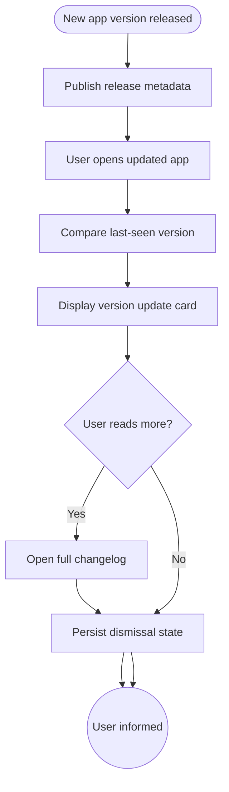

import FeatureSummary from '@site/src/components/FeatureSummary';

# New Features / Versions Notification Base

## Summary

<FeatureSummary />

## Narrative
Ignition includes a native changelog system so every release can highlight new capabilities inside the app. The notification base detects when the client upgrades, fetches the release notes payload, and surfaces a concise card that users can expand for full details. It persists until dismissed and links to deeper documentation when needed.

This base capability standardizes how we educate users about paid perks, AWAWAY upgrades, or new missions without relying solely on external channels.

## Interaction
1. Release pipeline publishes version metadata (features added, copy, assets) to the notification service.
2. When a user launches a newly updated app, the client checks the latest version seen.
3. If new content exists, display an in-app banner or modal summarizing key additions with “Read more” and “Dismiss” actions.
4. Selecting “Read more” opens a dedicated page or doc entry; dismissing sets a flag so the banner stays hidden.
5. The notification remains visible until the user interacts with it or the expiration date passes.
6. Admins can resend important notices or pin major upgrades.
7. Analytics track impressions, opens, and dismiss reasons to refine messaging.

:::caution Edge Case
If content fails to load (e.g., network offline), queue the notification and retry silently so users still see the message once connected.
:::

:::tip Signals of Success
- Majority of users notice new features within the first session post-update.
- Duplicate messaging is avoided because dismissal state syncs across devices.
- Product teams can publish changelog entries without engineering support.
:::

## Journey

## Requirements
- **Acceptance criteria**
  - GIVEN a new release is flagged as important WHEN users upgrade THEN a notification appears until they read or dismiss it.
  - GIVEN a user reads the full notes WHEN they return on another device THEN the notification stays dismissed thanks to synced state.
  - GIVEN content fails to download WHEN the app is offline THEN we retry and only show the banner once copy is available to avoid blank cards.
- **No-gos & risks**
  - Spamming every minor update will drive dismissals; reserve the banner for meaningful releases.
  - Hardcoding copy in the app makes localization impossible; rely on CMS payloads.
  - Forgetting accessibility labels (e.g., screen readers) would block some users from understanding the update.

## Data
- **Primary metric:** Read-through rate (users who open full notes ÷ users who saw the banner).
- **Secondary checks:** Dismissal rate, time between update and view, localization coverage, and offline fallback usage.
- **Telemetry requirements:** Log app version, banner impression timestamp, interactions, deep-link targets, acknowledgement timestamps, and content retrieval errors.

## Open Questions
- Do we support video or interactive sections inside the changelog in 1.0?
- Should enterprise partners receive tailored release notes separate from the consumer feed?
