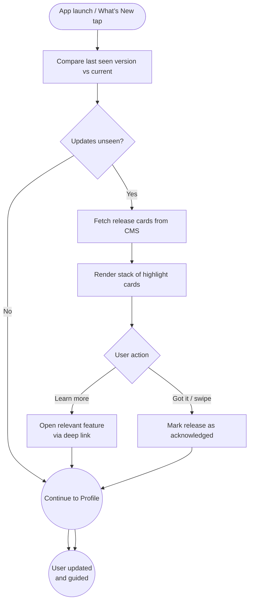

import FeatureSummary from '@site/src/components/FeatureSummary';

# New Features Notification Screen v0.2

## Summary

<FeatureSummary />

## Narrative
The New Features Notification Screen is the calm “What’s new” deck for v0.2 launches. When users open the app after an update, CMS-authored cards highlight the big capabilities (reaction wheel, history, feedback) and deep-link straight into the relevant surface.

Cards are grouped into Headline, “What’s new for you,” and “Under the hood,” and acknowledgement buttons track who has already viewed the content. Copy references the same definitions as the [Reactions Taxonomy](/docs/wiki/reactions/) so marketing, docs, and product stay aligned.

## Interaction
1. App detects a version bump (e.g., `0.2.x` vs last seen version) or user taps “What’s New.”
2. Client fetches release-note bundles from the CMS with card metadata, imagery references, and deep-link URIs.
3. Screen displays stacked cards with a gentle animation; each card offers “Learn more” to open the feature doc or the in-app surface.
4. User can swipe cards away or tap “Got it”; the app records acknowledgement and updates local state to avoid re-showing on the next launch.
5. If another release ships before the user dismisses the previous one, the screen merges decks and sorts by release date.
6. A final CTA invites users to leave feedback about the update, tying into the new feedback flow.

:::caution Edge Case
If the CMS fails to return content, the app falls back to a minimal offline card (“Reactions and history arrived in 0.2—explore in Profile”) while logging the failure for follow-up.
:::

:::tip Signals of Success
- ≥80 % of users acknowledge the 0.2 highlights within three sessions.
- Deep link taps lead to measurable increases in practice history and feedback engagement.
- Support sees fewer “What changed?” inquiries after releases.
:::

### Journey

## Requirements
- **Acceptance criteria**
  - GIVEN the app updates to 0.2 WHEN the user launches THEN the What’s New screen appears before Profile View with CMS-managed cards.
  - GIVEN the user taps a card WHEN a deep link exists THEN the app routes to the surface (e.g., Practice History) and logs the navigation.
  - GIVEN acknowledgement WHEN the user dismisses the deck THEN the app records the version and does not re-show until a newer release arrives.
- **No-gos & risks**
  - Overwhelming users with lengthy release notes; keep cards concise and calm.
  - Showing outdated cards because the CMS cache failed; implement TTL and fallbacks.
  - Blocking core flows if the user declines to engage; dismissal must be quick.

## Data
- Primary metric: Acknowledgement rate for the 0.2 release deck.
- Secondary checks: Deep-link click-through, dwell time per card, and feedback submissions triggered from the final CTA.
- Telemetry requirements: Log deck version served, card impressions, interactions (learn more, dismiss), deep link targets, and acknowledgement timestamps.

## Open Questions
- Should we personalize cards based on reaction history (e.g., highlight Practice History if the user has ≥10 sessions)?
- Do we auto-expire cards after a set number of sessions even without acknowledgement?
- How do we coordinate timing with push notifications for major releases to avoid redundancy?
