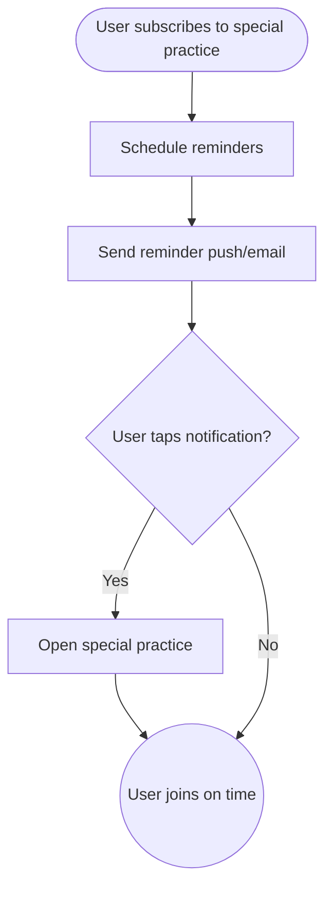

import FeatureSummary from '@site/src/components/FeatureSummary';

# Notifications for Upcoming Special Practices (Paid)

## Summary

<FeatureSummary />

## Narrative
Paid members can follow special master practices and receive early reminders. After subscribing to an event, they receive scheduled notifications (push/email) leading up to the start, so they never miss rare live experiences. Copy includes the master’s name, practice theme, and how to join.

## Interaction
1. User subscribes to a special practice from the schedule or master page.
2. Notification service stores the subscription and schedules reminders (e.g., 24h and 15m before start).
3. At each cadence, push/email is sent with join CTA and timezone-adjusted timing.
4. Tapping notification opens the practice details or live room.
5. Users can manage subscriptions from profile -> Notifications.
6. After the practice, a recap or recording link may be offered.
7. If the user unsubscribes, all future reminders cancel.

:::caution Edge Case
If the event time changes, automatically resend an updated notification plus calendar invite to avoid confusion.
:::

:::tip Signals of Success
- Reminder delivery occurs before start for every subscribed user.
- Tap-through leads to increased attendance.
- Opt-out rate remains low.
:::

## Journey

## Requirements
- **Acceptance criteria**
  - GIVEN a user subscribes WHEN the practice is scheduled THEN reminders are queued for all defined lead times.
  - GIVEN the practice time changes WHEN updates occur THEN users receive a change notification and calendar entry adjusts automatically.
  - GIVEN a user unsubscribes WHEN they manage notifications THEN all pending reminders cancel immediately.
- **No-gos & risks**
  - Sending reminders to non-paying users may violate exclusivity promises.
  - Incorrect timezones reduce trust; always localize.
  - Too many reminders can be bothersome; cap the cadence.

## Data
- **Primary metric:** Attendance uplift for users receiving reminders.
- **Secondary checks:** Delivery success, opt-out rate, time between reminder and join, and reschedule notifications sent.
- **Telemetry requirements:** Log subscription ID, scheduled send times, delivery status, taps, joins, cancellations, and reschedule events.

## Open Questions
- Do we support calendar file downloads (.ics) in addition to push/email?
- Should users choose their reminder cadence or stick with defaults in 1.0?
