import FeatureSummary from '@site/src/components/FeatureSummary';

# Offline Mode for Downloaded Audio (Paid)

## Summary

<FeatureSummary />

## Narrative
Paid members can rely on AWATERRA even without constant connectivity. Offline mode automatically preloads top practices, lets users manually download favorites (including My Practice templates), and keeps the last week of sessions accessible for reflection. When the device loses signal, the app gracefully switches to local playback, tracks completions, and syncs progress once back online.

Context from discovery:
- 🎯 Offline режим: designed for users without stable internet.
- Автоматическая предзагрузка топ практик + любимых Journey practices.
- Локальное сохранение выполненных практик with cloud backup when connection returns.

## Interaction
1. Paid user marks a practice for offline or toggles “Auto-download top practices.”
2. App encrypts and stores audio plus metadata locally, showing storage usage.
3. When connectivity drops, AWATERRA enters offline banner mode and surfaces downloaded content in a dedicated shelf.
4. User plays a practice; completion is logged locally and queued for sync.
5. Once connectivity resumes, completions, reactions, and streak updates upload automatically.
6. Downloads expire according to policy (e.g., seven-day archive) unless revalidated.
7. If the subscription lapses, offline content locks until the user renews.

:::caution Edge Case
If a user deletes the app before queued sessions sync, attempt cloud backup of metadata (not audio) so their history still reflects the offline practice once they reinstall.
:::

:::tip Signals of Success
- Offline playback is seamless with no crashes or missing audio.
- Sync reconciles without duplicates when connection returns.
- Storage usage stays predictable thanks to auto-cleanup of expired files.
:::

## Journey

```mermaid
%%{init: {'securityLevel': 'loose', 'flowchart': {'htmlLabels': true}}}%%
flowchart TD
    START([User downloads practice])
    STORE[Encrypt + store locally]
    OFFLINE{Network available?}
    PLAY[Play from device storage]
    QUEUE[Queue completion + data]
    SYNC[Sync when online]
    START --> STORE --> OFFLINE
    OFFLINE -->|No| PLAY --> QUEUE --> SYNC --> END((Offline session synced))
    OFFLINE -->|Yes| END((Stream online version))
    click SYNC "./paid-subscription-profile-v1-0" "Entitlements gate offline sync"
    click PLAY "./save-practice-paid-v1-0" "Saved list highlights downloaded practices"
```

## Requirements
- **Acceptance criteria**
  - GIVEN a paid user downloads a practice WHEN they go offline THEN the practice appears in the offline shelf and plays without buffering.
  - GIVEN the user completes an offline session WHEN connectivity returns THEN streaks, reactions, and unit rewards sync exactly once.
  - GIVEN downloads exceed storage limits WHEN the threshold is hit THEN the app prompts users to manage files and automatically removes oldest, expired sessions.
- **No-gos & risks**
  - Storing files unencrypted invites piracy; secure storage is mandatory.
  - Letting offline mode grant units without proof could be abused; maintain server validation with signed logs.
  - Forgetting to expire downloads might violate content licensing agreements.

## Data
- **Primary metric:** Successful offline session playback rate.
- **Secondary checks:** Sync success/failure, storage usage per user, auto-download opt-in percentage, and metadata backup success.
- **Telemetry requirements:** Log download requests, storage size, offline play events, queued sync items, conflicts/resolutions, and grace-lock events after subscription lapse.

## Open Questions
- Do we allow users to change the auto-download list or rely on curated top practices only?
- How long should offline files remain valid without reconnecting (seven days vs longer)?
