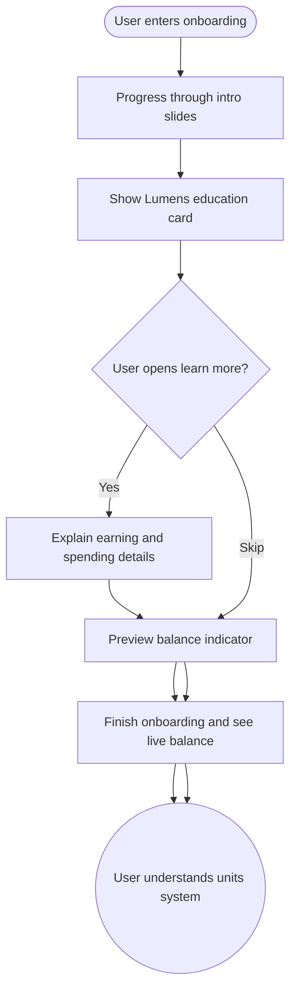

import FeatureSummary from '@site/src/components/FeatureSummary';

# Add Lumens to Onboarding Experience

## Summary

<FeatureSummary />

## Narrative
New users should understand why Lumens matter before they complete their first practice. The onboarding carousel now includes lightweight explanations of what units are, how they are earned, and how they can be used to support masters or the Pulse.

We blend education with aspiration: copy celebrates the currency, highlights its connection to collective care, and points to areas of the app where units show up later. Tooltips and micro-illustrations keep the tone warm rather than transactional.

## Interaction
1. User advances through onboarding slides and encounters a dedicated card about Lumens.
2. Card explains the core loop (practice to earn, spend to support) using the same visualization tokens as the main app.
3. Users can tap "Learn how to earn" for deeper guidance or skip if they already know the system.
4. On the final onboarding step we preview their starter balance (zero) and highlight the indicator they will see post-registration.
5. Once onboarding finishes the home screen shows the same balance chip to reinforce continuity.
6. Tooltips remain available for the first few sessions to remind users where to check balances or spend.
7. Analytics capture slide completion and whether the user opened the optional deep-dive link.

:::caution Edge Case
If onboarding is resumed mid-way (force quit, returning user), restore the last visited slide so the units education is not skipped.
:::

:::tip Signals of Success
- Majority of new users recall what Lumens represent.
- Engagement with early earning actions increases versus previous cohorts.
- Users skip fewer onboarding slides because the content feels relevant.
:::

## Journey

## Requirements
- **Acceptance criteria**
  - GIVEN a new user flows through onboarding WHEN they reach the units slide THEN copy, imagery, and CTA all render using the shared design system tokens.
  - GIVEN the user taps "Learn how to earn" WHEN the modal opens THEN it returns to the same onboarding slide upon dismissal.
  - GIVEN onboarding is interrupted WHEN the user returns THEN we resume at the units education slide they last saw without repeating prior content.
- **No-gos & risks**
  - Overloading onboarding with currency jargon can overwhelm users before they even sign in.
  - Showing inaccurate balances (anything other than zero) prior to account creation causes confusion.
  - Forgetting accessibility narration for the slides risks alienating screen reader users.

## Data
- **Primary metric:** Completion rate of the units education slide.
- **Secondary checks:** Learn-more taps, first-week earning behavior, tooltip dismissals, and survey recollection.
- **Telemetry requirements:** Log slide impressions, CTA taps, modal open/close events, resume points, and completion timestamps.

## Open Questions
- Should we let users dismiss unit tooltips permanently during onboarding, or only after they experience the feature in-product?
- Do we tailor the messaging for returning users who reinstall?
