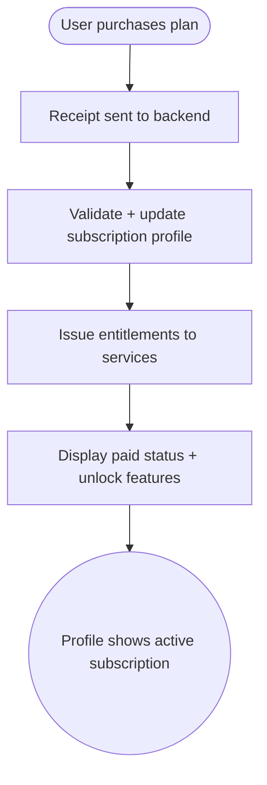

import FeatureSummary from '@site/src/components/FeatureSummary';

# Paid / Subscription Profile

## Summary

<FeatureSummary />

## Narrative
Ignition formalizes AWATERRA’s paid membership layer. The subscription profile service records plan entitlements, syncs billing status from app stores or web checkout, and propagates flags to every capability that gates premium features. Users should see their status instantly (“Ignition Member”) along with access to paid-only tabs such as Offline Mode, Saved Practices, master follow, and AWAWAY perks.

Profile metadata must stay consistent across devices and channels. When subscriptions renew, lapse, or upgrade, the profile updates automatically and adjusts available features without requiring manual refresh.

## Interaction
1. User selects or upgrades to a paid plan via Subscription Page or platform store.
2. Payment provider confirms purchase and sends receipt to backend.
3. Subscription profile service validates the receipt, updates plan tier, and issues entitlement tokens.
4. UI surfaces the paid badge, unlocked modules, and account details (renewal date, plan benefits).
5. Downstream features query the profile to show or hide paid capabilities.
6. If billing fails or the user cancels, the service schedules grace periods and communicates upcoming changes.
7. Users can view their plan history, manage payment method (where allowed), and download invoices.

:::caution Edge Case
If validation cannot reach the store, drop into a short grace state (e.g., 24 hours) where features remain accessible but surfaces show “Verifying subscription...” to avoid accidental lockouts.
:::

:::tip Signals of Success
- Subscription status updates across app surfaces within seconds of purchase or cancellation.
- Support requests about missing entitlements drop.
- Paid features remain inaccessible to non-subscribers without leaks.
:::

## Journey

## Requirements
- **Acceptance criteria**
  - GIVEN a purchase succeeds WHEN the backend validates the receipt THEN the profile updates and downstream entitlements refresh without user intervention.
  - GIVEN a plan lapses or is cancelled WHEN the grace period ends THEN paid features lock and messaging explains the change.
  - GIVEN a user switches devices WHEN they sign in THEN the subscription profile syncs automatically so entitlements mirror the backend state.
- **No-gos & risks**
  - Relying on client-side flags invites fraud; backends must be source of truth.
  - Slow propagation leads to user frustration (“I paid but nothing unlocked”).
  - Unclear downgrade messaging may cause chargebacks; always communicate grace periods and actions.

## Data
- **Primary metric:** Time from payment confirmation to entitlement activation.
- **Secondary checks:** Grace-period usage, entitlement mismatch rate, support tickets linked to billing, and grace-state entry count.
- **Telemetry requirements:** Log receipt validation outcomes, profile changes, entitlement refresh events, grace state transitions, and client sync timestamps.

## Open Questions
- Do we support multiple tiers at launch or a single paid plan?
- How do we expose invoices or payment management for app-store purchases versus direct web checkout?
