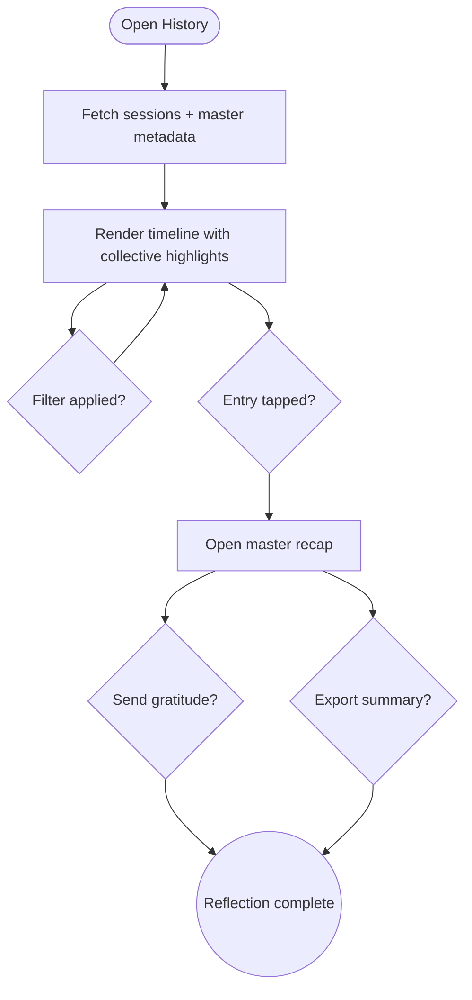

import FeatureSummary from '@site/src/components/FeatureSummary';

# History of Completed Practices with Reactions v0.3

## Summary

<FeatureSummary />

## Narrative
History gains master awareness in v0.3. Collective entries now appear with a golden accent, showing the master portrait, total attendees, and how the user’s reaction shifted compared to their baseline. Each entry groups pre-session feeling (captured at countdown) and post-session reaction so people can reflect on the change. Tapping opens a recap sheet with highlights, suggested thank-you note, and quick access to follow/unfollow.

Weeks view displays a "Collective highlights" row summarising which masters the user practiced with and their dominant reaction afterwards. Filters get a "Masters" toggle to browse entries by specific guides, plus a "Shared with community" view that only shows collective moments. Exported reports now include master metadata so partners receive de-identified insights when we share aggregated stats.

## Interaction
1. User opens History; client fetches standard practice timeline plus master metadata and pre-session reactions.
2. Collective entries render with stacked cards showing before/after feelings, master, attendees, and thank CTA.
3. Filters allow switching to "Masters" (select a guide) or "Collectives" (only community sessions).
4. Tapping an entry opens the recap sheet with audio replay (if available), gratitude template, and share/export options.
5. Users can submit a thank-you message that logs in Master Analytics and optionally posts to the master’s feed.
6. Export generates a summary including master names, languages, reactions, and attendance for personal journaling.

:::caution Edge Case
If the user joined late and skipped the pre-session reaction, show "No baseline captured" rather than falsifying data; encourage them to share how they feel now.
:::

:::tip Signals of Success
- Users revisit collective entries and send gratitude within 24 hours.
- Reaction deltas help users notice how specific masters affect them, leading to informed follow decisions.
- Exported reports include master data without exposing personal notes unintentionally.
:::

### Journey

## Requirements
- **Acceptance criteria**
  - GIVEN a collective session WHEN it appears in history THEN the card shows master name, participant count, before/after reactions, and thank CTA.
  - GIVEN the user filters by a master WHEN applied THEN only sessions led by that master remain, sorted chronologically.
  - GIVEN the user exports history WHEN done THEN the file includes master metadata and reaction deltas without leaking private notes unless explicitly opted in.
- **No-gos & risks**
  - Overwhelming the timeline with too many accents; keep collective styling elegant.
  - Mixing personal notes into exports shared with masters without explicit consent.
  - Inconsistent reaction delta calculations (server vs client).
- **Data**
  - Track thank-you sends, replay taps, filter usage, and export frequency for collective entries.

## Open Questions
- Do we capture optional "pre-session mood" prompts for non-collective practices to compare against collective deltas?
- Should gratitude messages be visible to other participants or remain private between user and master?
- How long should recaps remain available for replay—24 hours or longer if the master opts in?
