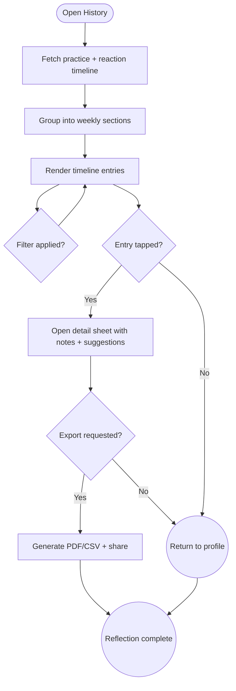

import FeatureSummary from '@site/src/components/FeatureSummary';

# History of Completed Practices with Reactions

## Summary

<FeatureSummary />

## Narrative
The History of Completed Practices with Reactions gives people a reflective journal anchored in their practice sessions. Each entry shows the practice name, master, duration, reaction state (color-coded), optional notes, and whether the session ignited their light. The list groups by week with a calm timeline design so users can see streaks and shifts in how they felt. Filters let them drill into specific states (“Show me when I felt Grounded”) or masters. Exportable summaries support sharing progress with mentors or friends.

History pulls from the Practices Reactions Base and practice completion records. It caches the most recent month and lazily loads older sessions. For each entry, the UI offers nudges—if the user recorded mostly Grounded states, they’ll see a tip to explore Energise practices. The interaction stays gentle: no gamification, just insights and optional sharing.

## Interaction
1. User opens History via Profile View or completion screen.
2. Client requests the last 30 days of practice sessions with reactions; results stream into weekly groups.
3. Entries display practice metadata, reaction chip (color + name), optional note preview, and icons for favourites or shared sessions.
4. Filters across the top allow state, master, or modality selections; results update instantly.
5. Tapping an entry opens detail view with full notes, timer data, and suggested next practice.
6. Users can export PDF/CSV via share sheet; the app logs the export and obfuscates sensitive notes on-device if the user chooses.

:::caution Edge Case
If reaction data is missing for a session, display a placeholder (“No feeling recorded”) and prompt the user to add a reaction retroactively; never delete the session.
:::

:::tip Signals of Success
- Users return to History weekly to reflect (≥25 % of active users).
- Reaction filters drive exploration; people act on suggestions after browsing.
- Exports help with community sharing without exposing private notes unintentionally.
:::

### Journey

## Requirements
- **Acceptance criteria**
  - GIVEN the user opens History WHEN data loads THEN sessions appear grouped by week with practice title, master, duration, reaction chip, and light status.
  - GIVEN the user applies a reaction filter WHEN results refresh THEN only sessions matching the selected states display with accurate counts.
  - GIVEN an entry without reaction WHEN the user taps it THEN the detail sheet invites them to add or edit the reaction before closing.
  - GIVEN the user exports history WHEN they confirm export THEN the file includes practice metadata, reaction labels, and timestamps while respecting privacy settings.
- **No-gos & risks**
  - Overwhelming the timeline with too much text; keep entries concise and expandable.
  - Exposing private notes in exports without explicit confirmation.
  - Failing to sync new sessions promptly, which would undermine trust in the history view.

## Data
- Primary metric: Weekly active users of History (unique viewers ÷ total active users).
- Secondary checks: Filter usage, detail view engagement, export frequency, and retroactive reaction edits.
- Telemetry requirements: Log history fetch latency, filter interactions, entry taps, retroactive additions, and export actions (type, size, success/failure).

## Open Questions
- Should we surface aggregated insights (e.g., “You felt Peaceful most on Sundays”) in 0.2 or hold for 0.3?
- Do we let users delete individual history entries, or keep the record immutable?
- How do we handle sessions started offline—should we prompt for reaction sync on reconnect?
