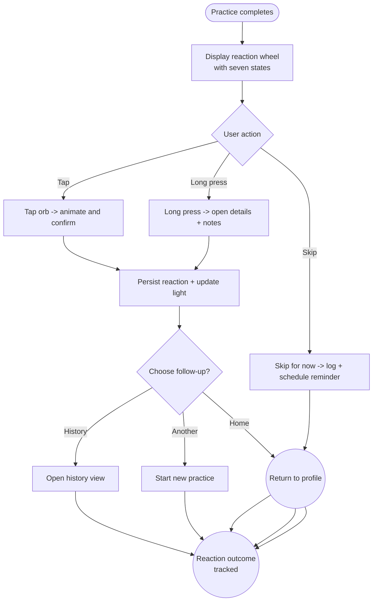

import FeatureSummary from '@site/src/components/FeatureSummary';

# Practice Reaction

## Summary

<FeatureSummary />

## Narrative
Practice Reaction is the moment a session becomes insight. When a practice ends, we invite the user to choose how they feel from seven curated states: Grounded, Joy, Energy, Peace, Release, Insight, Unity. Each state is represented by a color-coded orb and a subtle description pulled from the CMS (“I feel rooted and steady,” “I feel expansive and connected”). Selecting a state stores the reaction, animates Light Ignition with matching hues, and feeds the history, profile wheel, and analytics.

The experience balances speed and reflection. Users can tap once to submit or long-press to open an expanded description with journaling tips. If they’re unsure, a “Skip for now” option records the session without a reaction but gently reminds them later. For accessibility, states are announced with labels and example scenarios. The final screen offers optional notes (voice or text) and a shortcut to share feedback.

The seven-state vocabulary is defined centrally in the [Reactions Taxonomy](/docs/wiki/reactions/) so every surface reads and writes the same identifiers and copy.

## Interaction
1. Practice completes; completion animation fades into the reaction prompt.
2. Seven orbs arrange in a circle with the dominant suggestion (based on prior trends) highlighted; users can swipe to read descriptions.
3. Tapping an orb selects it, plays a soft pulse animation, and shows a confirmation banner (“Saved as Peaceful”).
4. Long-pressing opens detail modal with copy, recommended next practice types, and ability to attach notes.
5. After confirmation, the system saves the reaction via Practices Reactions Base, updates Light Ignition, and offers “See my reactions history” or “Start another practice.”
6. If the user skips, the system logs the choice and schedules a gentle notification inviting them to log feelings later.

:::caution Edge Case
If the reaction save fails (network loss), the app caches the selection locally and shows a banner (“We’ll sync your feeling once you’re back online”) while retrying silently.
:::

:::tip Signals of Success
- ≥85 % of completed practices capture a reaction within 30 seconds.
- Long-press usage indicates curiosity about deeper descriptions.
- Skipped reactions convert later via reminders without feeling nagging.
:::

### Journey

## Requirements
- **Acceptance criteria**
  - GIVEN a practice finishes WHEN the reaction prompt appears THEN seven states display with names, colors, and short descriptions matching the taxonomy.
  - GIVEN the user selects a state WHEN the confirmation appears THEN the reaction posts to the backend, Light Ignition updates, and the profile wheel reflects the new state.
  - GIVEN offline completion WHEN the user selects a reaction THEN the app stores it locally, surfaces an offline badge, and syncs once reconnected.
  - GIVEN the user long-presses a state WHEN the detail modal appears THEN they can read extended copy, add notes, and save without returning to the wheel.
- **No-gos & risks**
  - Overloading the moment with too many options; keep to the seven curated states.
  - Forcing users to choose when they truly don’t know—“Skip” must remain respectful.
  - Animations that feel frenetic; keep motion slow and soothing.

## Data
- Primary metric: Reaction capture rate per practice (submissions ÷ completions).
- Secondary checks: Long-press usage, note attachment rate, skip conversions, and retry success for offline saves.
- Telemetry requirements: Log prompt impressions, selection events with state id, long-press detail opens, note attachments, skip events, and sync outcomes.

## Open Questions
- Should we allow users to tag intensity (e.g., mild vs strong) in 0.2 or defer?
- Do we surface custom states for cohorts later, and how would the UI adapt?
- What’s the right cadence for reminders when users skip logging feelings?
