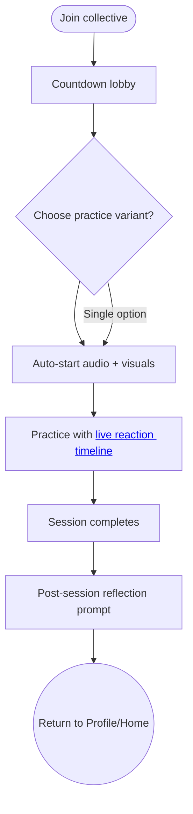

import FeatureSummary from '@site/src/components/FeatureSummary';

# Practice Screen v0.3 (Masters)

## Summary

<FeatureSummary />

## Narrative
The masters practice screen orchestrates the full communal journey described in the collective brief. On entry, users land in a pre-session state with the master planet, countdown, and CTA "Light your flame." They can pick from seven base practices if the session allows alternatives; otherwise the primary audio is preselected. The emphasis is on settling in together.

As T-5 minutes hits, the screen shows the master avatar, a participant counter, and a mini-map where lights blink as people join. Subtle pulses along the globe communicate collective presence without calling for interaction. Once the countdown reaches zero, audio autoplays and the visuals soften.

A central feature of the screen is the audio playback timeline. This timeline not only shows progress through the session but also serves as a canvas for collective feeling. Throughout the practice, participants can leave timestamped reactions that appear directly on the timeline, creating a shared and visible emotional journey for the community, as detailed in [Reactions v0.3](./reactions-masters-v0-3.md).

When the audio ends, the screen transitions to a closing state: "We were 247 souls" plus "We ignited XXX AU," with calm share/exit options. A dedicated reflection prompt then unlocks, letting the user record how the collective session landed (see [Practice History Reactions](./practice-history-reactions-v0-3)) before returning home.

## Interaction
1. User joins; pre-session screen displays countdown, master details, practice options (if multiple), and "I’m ready." CTA.
2. Countdown continues with subtle presence indicators. The reaction timeline is visible but may be inactive until the practice starts.
3. Audio autostarts; UI simplifies to playback status, the interactive reaction timeline, and optional Pause/Skip.
4. Upon completion, recap metrics and AU contribution display alongside a reflection CTA that opens the post-session prompt.
5. After submitting or skipping the reflection, the user exits to Home or Profile with the session recorded.

:::caution Edge Case
If the user loses connection mid-session, keep playback local and queue any reflection entry the moment the session completes; sync it silently when the link restores so the experience stays calm.
:::

:::tip Signals of Success
- Participants remain present through the entire session without seeking interaction cues.
- A strong share of users complete the post-session reflection before exiting.
- Mini-map and participant count reinforce collective presence without overwhelming visuals.
:::

### Journey

## Requirements
- **Acceptance criteria**
  - GIVEN the user arrives before start WHEN countdown runs THEN the screen displays master details, participant count, and "I’m ready" while keeping reflection controls hidden.
  - GIVEN the practice begins WHEN audio autostarts THEN the reaction timeline becomes active, allowing users to share feelings throughout the session.
  - GIVEN the session ends WHEN recap data is available THEN totals, AU contribution, and the reflection CTA display before returning to home.
- **No-gos & risks**
  - Audio auto-playing without respecting device silent mode rules—provide haptics/visual cues.
  - Mid-session prompts that pull users out of the guided state (reactions should be user-initiated and non-intrusive).
  - Losing post-session reflections when the connection drops before sync.
## Data
- **Primary metric:** Session completion rate (users who remain through the audio ÷ joins).
- **Secondary checks:** Countdown drop-offs, reflection submission vs skip rate, reaction timeline usage, and AU contribution consistency.
- **Telemetry requirements:** Log join timestamps, variant selections, reaction events, playback errors, recap metrics, and reflection payloads (success/fail).

## Open Questions
- Should we allow participants to defer the reflection prompt and receive a gentle reminder later in Profile?
- Do we surface aggregated session reflections back to the community or keep them private to masters/operators?
- Should masters be able to add a closing text or audio note that appears alongside the recap metrics?
