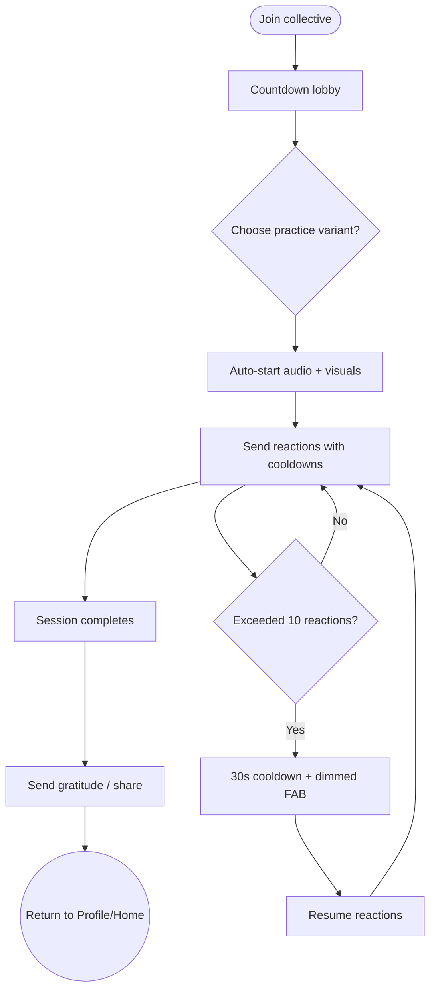

import FeatureSummary from '@site/src/components/FeatureSummary';

# Practice Screen v0.3 (Masters)

## Summary

<FeatureSummary />

## Narrative
The masters practice screen orchestrates the full communal journey described in the collective brief. On entry, users land in a pre-session state with the master planet, countdown, and CTA "Light your flame." They can pick from seven base practices if the session allows alternatives; otherwise the primary audio is preselected. A floating reaction button remains hidden until five seconds before start, then animates into place as a soft FAB on the lower right.

As T-5 minutes hits, the screen shows the master avatar, a participant counter, and a mini-map where lights blink as people join. Once the countdown reaches zero, audio autoplays, the globe zooms slightly, and the reaction tray fans out after five seconds, allowing the first emotional send. Each reaction triggers a crystal-chime, launches coloured emoji along an arc toward the mini-map, and increments both the personal counter (max one every 3 seconds, pause after 10) and the shared bar that shows which state currently leads.

During cooldowns, the reaction button dims and shows a timer ring; after personal quota resets (30-second rest after 10 sends), it brightens again. The practice remains hands-free otherwise—users can tap "Pause" or "Skip" if necessary but the default expects stillness. When audio ends, the screen transitions to a closing state: "We were 247 souls" plus "We ignited XXX AU." A "Thank the master" button opens a gratitude prompt, while "Share light" lets them post to community if available.

## Interaction
1. User joins; pre-session screen displays countdown, master details, practice options (if multiple), and "I’m ready." CTA.
2. Reaction FAB remains hidden until T-5s, then slides in and hovers, inviting the first send.
3. Audio autostarts; reaction tray appears showing 7–10 customised emojis for collective states.
4. User taps reaction; haptic feedback (50 ms) fires, emoji animates toward centre, and cooldown timer begins (3 seconds per send, 30-second rest after 10).
5. Participant counter updates, mini-map pulses with new arrivals, and shared reaction bar fills by colour.
6. Completion state shows totals, AU, gratitude CTA, replay availability, and options to add notes.

:::caution Edge Case
If the user loses connection mid-session, keep playback local but mark reactions as pending; resend silently when the link restores so the experience stays calm.
:::

:::tip Signals of Success
- Cooldown design prevents spam while keeping reactions lively and meaningful.
- Users stay through the closing recap and send gratitude before exiting.
- Mini-map and participant count reinforce collective presence without overwhelming visuals.
:::

### Journey

## Requirements
- **Acceptance criteria**
  - GIVEN the user arrives before start WHEN countdown runs THEN the screen displays master details, participant count, and "I’m ready" without allowing reactions yet.
  - GIVEN the practice begins WHEN audio autostarts THEN reaction FAB appears after five seconds and respects cooldown limits (1 per 3s, 10 then 30s rest).
  - GIVEN the session ends WHEN recap data is available THEN totals, AU contribution, and thank-you CTA display before returning to home.
- **No-gos & risks**
  - Audio auto-playing without respecting device silent mode rules—provide haptics/visual cues.
  - Reaction spam or cooldown bugs that frustrate participants.
  - Visual overload that detracts from calm guidance (keep animations smooth, not flashy).
- **Data**
  - Capture join times, reaction counts per user, cooldown usage, completion rate, gratitude submissions, and drop-offs during countdown.

## Open Questions
- Should we allow manual muting of sound cues (reaction chimes) per user preference in v0.3?
- How do we support accessibility for users who cannot tap reactions quickly—voice or gesture alternatives?
- Do we expose master commentary (text prompts) mid-session or keep audio-only for now?
