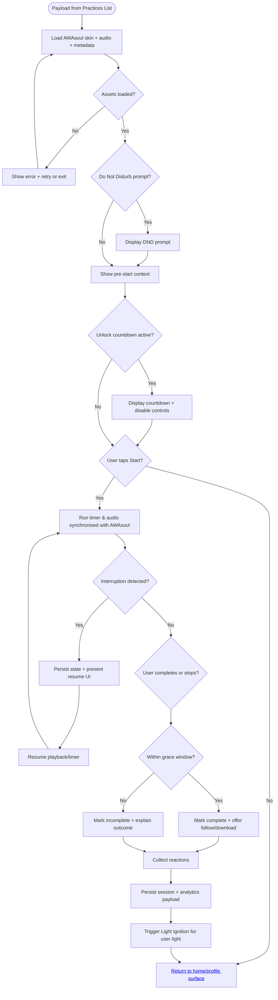

import FeatureSummary from '@site/src/components/FeatureSummary';

# Practice Screen

## Summary

<FeatureSummary />

## Narrative
The Practice Screen takes over once the [Practices List](/docs/features/practices-list) passes along the selected practice metadata. It reads the same wiki-backed payload that shapes the list, including the modality specifics outlined in [Light Practice](/docs/wiki/practices/light-practice), [Special Practice](/docs/wiki/practices/special-practice), [My Practice](/docs/wiki/practices/my-practice), and the broader [Masters Practices capability](/docs/wiki/capabilities/Masters-Practices). AWAsoul stays in frame for the entire flow, shifting skins and motion cues to guide practitioners through preparation, the active session, and the wind-down state that follows.

From launch to completion the path stays focused: confirm readiness, let AWAsoul hold space during the timer or audio journey, complete the session with reactions and optional follow/download controls, then illuminate the user light via the [Light Ignition](/docs/features/light-ignition) system before returning the practitioner to the home/profile surface.

## Interaction
1. Receive practice payload from the list (id, modality, duration selection, unlock state, audio asset ids, AWAsoul skin, grace window, follow/download flags).
2. Resolve required assets: stream or prefetch audio, load AWAsoul configuration, fetch master portrait, hydrate reaction set, and prepare download eligibility.
3. If metadata flags a do-not-disturb prompt, surface it before the pre-start state; otherwise, show the pre-start context immediately with AWAsoul animating in the designated skin.
4. For locked or countdown scenarios (Special Practice, scheduled releases), display the countdown and disable Start until the unlock timestamp is met.
5. On Start, launch timer logic appropriate to the practice: fixed timer, selectable preset, or manual countdown with grace tracking; begin audio playback when defined and keep AWAsoul synchronized with the modality.
6. Maintain controls for pause/resume, mute, finish, and optional captions while AWAsoul visuals respond to state changes and accessibility preferences.
7. Detect interruptions (phone calls, app backgrounding, connectivity drops), persist the session state, and offer a resume affordance when returning.
8. On completion or manual finish, evaluate grace window rules, capture reactions, surface follow/download CTAs, and persist the session payload to the service.
9. When completion is valid, trigger Light Ignition so the user light updates on the globe/home view, then navigate back to the home/profile surface; on invalid runs, surface copy that clarifies the outcome before the same return path.
10. Fire analytics events for start, pause, resume, completion outcome (complete/incomplete), reaction choice, follow/download interactions, interruption recovery, and user-light activation.

:::caution Edge Cases
- Asset failures (audio missing, AWAsoul skin unavailable): present a graceful error, allow retry, and log diagnostics before offering exit back to the list.
- Interruption over grace limits: resume timers accurately and, if the grace threshold is exceeded, mark the session incomplete with clear messaging referenced from the wiki copy.
- Offline completion: defer follow/download actions until connectivity returns, but queue the session payload locally to avoid data loss while still preparing the user light update once online.
:::

:::tip Signals of Success
- Sessions run without visual or audio glitches as AWAsoul guides attention.
- Resume success rate stays high after interruptions, with accurate duration logging.
- Telemetry payloads match the metadata schema (practice id, selected duration, actual duration, reaction, follow/download state, light-ignition trigger).
:::

## Scenarios
- **Guided or Sound Meditation**: Stream audio, synchronize timer and AWAsoul animations, enable captions, and allow downloads when flagged.
- **My Practice**: Follow the self-logged countdown rules from the wiki entry, capturing modality and duration without download offers.
- **Special Practice**: Honour unlock countdown, swap to the bespoke AWAsoul presentation, and enforce synchronized start time.
- **Interruption & resume**: Persist playback position and timer state, surface resume UI, and handle edge cases where the grace window expires while in the background.
- **Offline session**: Fall back to cached assets, queue analytics, and notify the user that follow/download actions and light updates will sync on reconnection.

## Reference Wiki Entries
- [Light Practice](/docs/wiki/practices/light-practice)
- [Special Practice](/docs/wiki/practices/special-practice)
- [My Practice](/docs/wiki/practices/my-practice)
- [Masters Practices capability](/docs/wiki/capabilities/Masters-Practices)

### Journey

## Requirements
- **Acceptance criteria**
  - GIVEN the payload WHEN the Practice Screen loads THEN AWAsoul, audio, timers, buttons, and copy reflect the metadata without divergence or missing fields.
  - GIVEN an asset fails to load WHEN the user chooses retry THEN the screen attempts reinitialisation and logs diagnostics before offering to return to the list.
  - GIVEN the session is interrupted WHEN the user resumes within the grace window THEN playback and timers pick up at the persisted state.
  - GIVEN the grace window is exceeded (My Practice, manual finish early) WHEN completion occurs THEN the result view marks the session incomplete and logs the reason code.
  - GIVEN follow/download flags WHEN the result view renders THEN only eligible CTAs display and their interactions write to analytics, while valid completions trigger the user light update before routing home.
- **No-gos & risks**
  - Allowing sessions to start before unlock, which would desynchronise Special Practice rituals.
  - Losing state on interruption, resulting in incorrect duration logging and frustrated users.
  - Surfacing follow/download CTAs or light ignition cues when the wiki marks them inactive, leading to broken expectations.

## Data
- Primary metric: Practice completion rate vs. starts by modality.
- Secondary checks: Pause/resume recovery success, grace window overruns, download/follow conversions, interruption frequency, audio error rate, successful light-ignition triggers.
- Telemetry requirements: Log practice id, selected duration, actual duration, modality, reaction, follow/download actions, interruption flags, error codes, asset load timings, unlock timestamps, and light-ignition status.

## Open Questions
- Should we pre-cache multiple audio quality tiers to maintain quality under poor networks while preserving continuity?
- Do we surface live captions translated from the master narrative for accessibility at launch or phase later?
- How do we keep AWAsoul skins lightweight enough for lower-end devices without losing the guiding presence?
