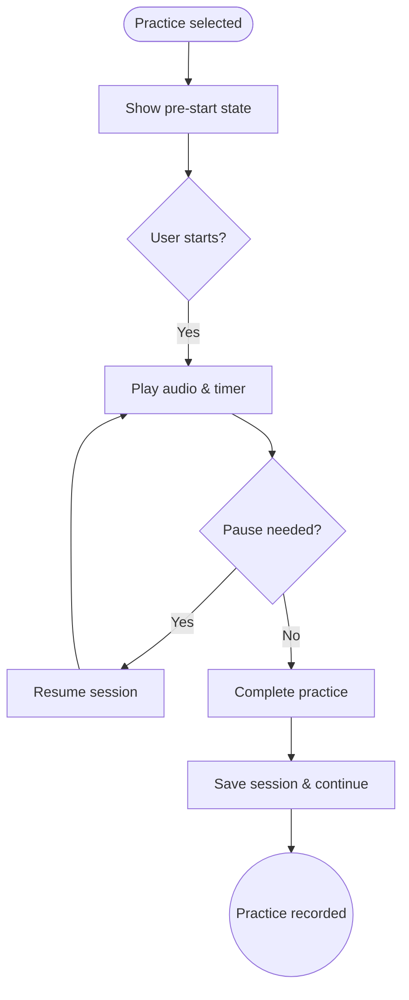

import FeatureSummary from '@site/src/components/FeatureSummary';

# Practice Screen

## One-Glance Summary

<FeatureSummary />

## Narrative
The Practice Screen delivers the core AWATERRA experience. Soft gradients, AWA Soul breathing animations, and ambient audio help users settle into focus.

Controls stay simple with clear start, pause, mute, and finish actions so attention remains on inner work. Guests still record a session and see the benefit of creating an account.

## Interaction Blueprint
1. Load practice assets (audio, visuals, guidance text) and prepare do-not-disturb prompt.
2. Display a calming pre-start state with session description and start CTA.
3. On start, trigger countdown timer, audio playback, optionally haptic breathing cues.
4. Allow pause/resume with confirmation to prevent accidental stops.
5. On completion, surface finish CTA, gratitude prompt, and optional reaction/feedback.
6. Persist session data, then route to Profile View or Light Ignition celebration.

:::caution Edge Case
User receives an interruption such as a call or notification. Save the session state and make it easy to resume.
:::

:::tip Signals of Success
- Completion rate stays high without technical glitches or audio dropouts.
- Users understand controls instantly and report a calm, focused experience.
- Session telemetry records time-on-task and outcomes reliably.
:::

### Journey

## Requirements & Guardrails
- **Acceptance criteria**
  - GIVEN a user starts a session WHEN countdown ends THEN audio and visuals play synchronously until completion or pause.
  - GIVEN the user finishes WHEN they tap “Finish practice” THEN data logs and the celebration flow triggers within one second.
  - GIVEN the user is a guest WHEN they complete THEN a gentle prompt offers profile creation without blocking exit.
- **No-gos & risks**
  - Busy UI or aggressive animations that distract from mindfulness.
  - Losing session progress after app backgrounding.
  - Failing to respect user settings (mute, vibration, dark mode).

## Data & Measurement
- Primary metric: Practice completion rate vs. starts.
- Secondary checks: Average session duration variance, pause frequency, and feedback submissions.
- Telemetry requirements: Log session start/stop timestamps, control interactions, audio errors, and completion outcomes.

## Open Questions
- Should we preload multiple audio tracks to reduce gaps when users switch practices mid-session?
- How do we integrate adaptive guidance (e.g., shorter practices for busy moments) in future releases?
