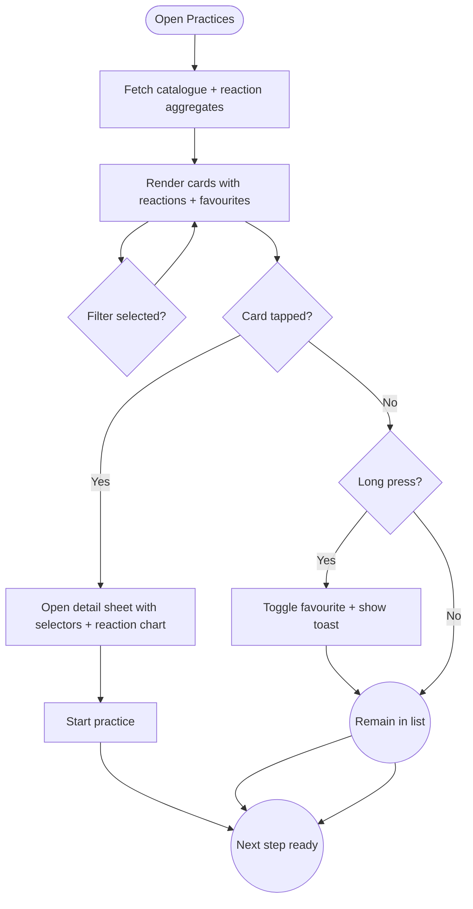

import FeatureSummary from '@site/src/components/FeatureSummary';

# Practices List v0.2

## Summary

<FeatureSummary />

## Narrative
Practices List v0.2 builds on the v0.1 catalogue with reaction intelligence and personalization. Cards still show master portrait, duration, and availability badges, but now include a reaction chip summarizing how other users feel after the practice (“Mostly Peace,” “Strong Energy”). Saved favourites pin to the top, and badges highlight when a session aligns with the user’s current dominant state from Profile View. The design stays serene, using rounded cards and soft gradients while bringing forward the information needed to choose quickly.

The list retrieves data from the CMS (practice metadata) and Practices Reactions Base (aggregate reactions). Filters let users focus on specific states (“I need Grounding tonight”), durations, or masters. Long-pressing a card favourites it, while tapping opens the familiar sheet with descriptions, selectors, and the reaction breakdown. Cards animate into view without jarring transitions, ensuring the catalogue remains a calming step before practice.

## Interaction
1. User opens the list; client requests the latest catalogue plus reaction aggregates.
2. Cards render in curated order with reaction chips (top three states by percentage) and availability labels (new, limited, archived soon).
3. Top-of-list filter pills allow filtering by reaction state, duration, master, or favourites.
4. Tapping a card opens the detail sheet with full copy, audio preview, reaction chart, and selectors; the Start button respects validations.
5. Long-pressing on a card toggles favourite state; a subtle toast confirms the action.
6. As background updates arrive (e.g., practice rotates out), the list gracefully fades cards out/in without shifting scroll position unexpectedly.

:::caution Edge Case
If reaction data is missing for a practice, the card displays “New practice—help us learn how it feels” instead of leaving a blank space. Analytics tracks such cases to backfill later.
:::

:::tip Signals of Success
- Reaction-filter usage grows session alignment (users intentionally choose practices that balance their state).
- Favourite pins drive repeat sessions without hunting through the catalogue.
- Load times stay under 500 ms after payload resolve despite richer data.
:::

### Journey

## Requirements
- **Acceptance criteria**
  - GIVEN the user opens the list WHEN data loads THEN cards display reaction chips showing the top state(s) with percentages and contextual copy.
  - GIVEN the user applies a reaction filter WHEN results refresh THEN only practices aligned with that state appear in order, updating chips accordingly.
  - GIVEN the user long-presses a practice WHEN the favourite toggles THEN the card animates, a confirmation toast appears, and the practice pins to the favourites row on next visit.
  - GIVEN catalogue updates (rotation) WHEN the app receives a delta THEN removed cards fade out and new cards insert at defined positions without jumping the scroll.
- **No-gos & risks**
  - Overloading cards with text; keep reaction chips succinct.
  - Pinning too many favourites and breaking layout; limit to four pinned items.
  - Allowing stale reaction data; enforce TTL and fallback messaging.

## Data
- Primary metric: Start rate from the list (starts ÷ card impressions).
- Secondary checks: Reaction filter usage, favourite toggles, detail sheet dwell time, and list load latency.
- Telemetry requirements: Log catalogue version, reaction aggregates served, filter selections, favourite toggles, detail sheet opens, start confirmations, and rotation delta events.

## Open Questions
- Should we highlight contrast recommendations (“Need a different feeling?”) directly on cards or keep them in detail sheets?
- Do we prefetch audio previews for favourites to remove wait time?
- How do we visualize limited-time practices without creating urgency that disrupts calm?
