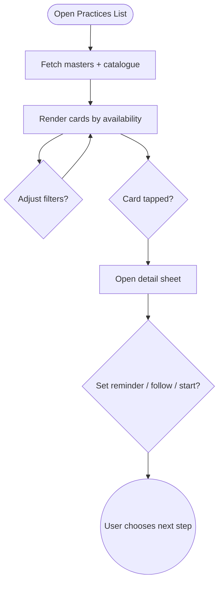

import FeatureSummary from '@site/src/components/FeatureSummary';

# Practices List v0.3 (Masters Catalogue)

## Summary

<FeatureSummary />

## Narrative
The catalogue expands in v0.3 to showcase masters alongside standard sessions. Cards now include the master portrait, language chips, and a badge signalling whether the session is live, upcoming, or on-demand replay. Collective practices float to the top when a countdown is active, accompanied by a soft glow that matches Home View stories. Filters gain two new tabs: "Masters" (followed, recommended, trending) and "Languages" with quick toggles for RU, EN, and any future additions. Reaction badges still summarise how past participants felt, now explicitly showing the master’s average impact.

When a user taps into a card, the detail sheet exposes the master’s affirmation, a short excerpt of the audio, and follow/reminder switches. The design stays calm even with the new metadata—text remains concise, and animations are gentle fades. Users can still favourite practices; favourites now pin within their respective master group so repeated sessions stay easy to reach.

## Interaction
1. List loads practise catalogue plus master metadata (languages, collective schedule, reaction aggregates).
2. By default, followed masters appear first, followed by upcoming collectives, then evergreen sessions.
3. Filter pill bar includes "Masters" (All, Followed, Suggested) and "Language" (All, RU, EN, etc.).
4. Tapping a collective card opens a sheet with countdown, reminder toggle, add-to-calendar, and "Visit visualization" preview.
5. Long-pressing favourites still pins them; when the master is live the card animates to the top temporarily.
6. After the collective ends, the card transitions to replay state while preserving reminder status for future sessions.

:::caution Edge Case
Avoid duplicating cards when a practice has multiple language tracks—group them under one master card with selectable audio options.
:::

:::tip Signals of Success
- Users filter by language before joining, reducing drop-offs from mismatched content.
- Reminder toggles from the list sync with Home View and Practice Screen reliably.
- Collective cards drive high tap-through to the visualization screen when live.
:::

### Journey

## Requirements
- **Acceptance criteria**
  - GIVEN the user follows masters WHEN the list loads THEN their sessions appear in the first section with correct status badges.
  - GIVEN language filters are selected WHEN applied THEN only sessions with those language tracks remain visible.
  - GIVEN a collective is within countdown WHEN the card is tapped THEN the detail sheet shows accurate timing, reminder switch, and link to visualization.
- **No-gos & risks**
  - Treating each language as a separate card, which would clutter the catalogue.
  - Losing calmness with overly animated badges—keep transitions soft.
  - Unsynchronised follow/reminder states between catalogue and profile.
- **Data**
  - Monitor filter usage, reminder toggles, follow conversions, and start rates per master.

## Open Questions
- Should follow status automatically favourite all of a master’s practices or remain separate controls?
- How do we display limited-capacity collectives (e.g., 100 seats) without adding stress to the calm UI?
- Do we prefetch replay audio when the user hovers/scrolls, or load only on demand for bandwidth savings?
