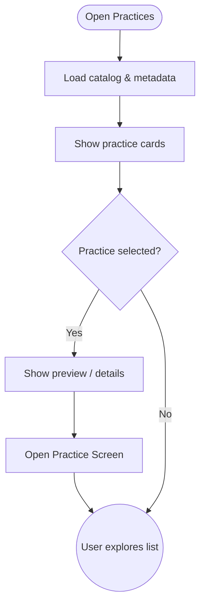

import FeatureSummary from '@site/src/components/FeatureSummary';

# Practices List

## Summary

<FeatureSummary />

## Narrative
Practices List presents the modalities defined in the [Practices catalogue](/docs/wiki/practices/). Each card mirrors the availability rules from the wiki so users always see the right daily rotations and event unlocks without hardcoded assumptions, while capability ownership stays aligned with the global [Capability catalogue](/docs/wiki/capabilities/).

Cards use mindful motion, master portraits, and duration badges to set expectations before a tap. When a user selects a card, the pop-up information sheet surfaces the same copy and controls documented in the practice wiki entries, keeping design, content, and engineering in lockstep.

## Interaction
1. Retrieve the daily catalogue with availability metadata (practice ids, order, rotation slots, countdown timers, master data, download flags).
2. Render practice cards in the order provided, displaying portraits, icons, and duration logic sourced from the wiki-backed payload.
3. When a card is tapped, open the pop-up information sheet populated with the wiki’s "Pop-Up Card Content" fields.
4. Allow the user to start playback or configure selectors (duration presets, modality dropdown for My Practice) directly from the pop-up.
5. Transition to the Practice Screen after the user confirms start, passing along practice id, selected duration, and modality selections.
6. Log impressions, pop-up opens, selector changes, and practice starts for analytics.

:::caution Edge Case
Network latency delays content. Show placeholders and allow offline cached practices where possible.
:::

:::tip Signals of Success
- Catalog loads within target time and drives practice starts.
- Users engage with “My Practice” customization without confusion.
- Reaction counts and favorites encourage social proof without pressure.
:::

### Journey

## Requirements
- **Acceptance criteria**
  - GIVEN the feature loads WHEN the catalogue API responds THEN practice cards appear in the order and availability state supplied by the wiki-backed payload (no fallback constants).
  - GIVEN a user opens a practice card WHEN the pop-up displays THEN the content matches the corresponding wiki entry, including master sections, descriptions, and control options.
  - GIVEN My Practice WHEN the pop-up opens THEN the modality dropdown and manual duration input validate entries before enabling Start.
- **No-gos & risks**
  - Showing expired or unavailable practices because rotation metadata lags behind the wiki rules.
  - Letting pop-up copy drift from the wiki source-of-truth, leading to mismatched expectations.
  - Breaking accessibility by hiding essential info (e.g., countdown, master data) behind color-only treatments.

## Data
- Primary metric: Practice start rate per session from the list view segmented by practice type.
- Secondary checks: Pop-up open-to-start conversion, duration preset usage, and My Practice completion logging.
- Telemetry requirements: Log catalogue version, card impressions, pop-up opens, selector adjustments, start confirmations, and error fallback events.

## Open Questions
- Should we schedule rotating featured practices for launch or rely on manual curation?
- How might we incorporate audio previews or instructor snippets without slowing the list?
