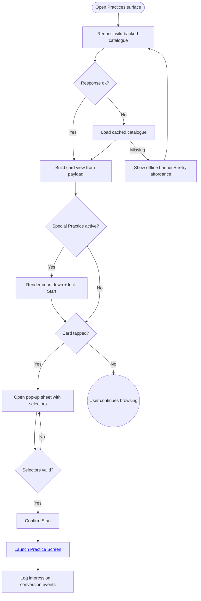

import FeatureSummary from '@site/src/components/FeatureSummary';

# Practices List

## Summary

<FeatureSummary />

## Narrative
Practices List orchestrates the first step of the Practice capability. It pulls the catalogue defined in the [Practices wiki](/docs/wiki/practices/) and renders the daily mix with rotation windows, countdowns, and master metadata intact. Copy, availability, selectors, and imagery all stay in sync with the wiki payload, ensuring the [Practice Screen](/docs/features/practice-screen) receives a clean hand-off without hardcoded assumptions.

When the catalogue refreshes—new Light Practice, Special Practice unlock, or rotation sunset—the list snaps to the latest order. Offline caches cover transient outages, and analytics events capture every impression, pop-up open, selector adjustment, and start so we can tune engagement.

## Interaction
1. Request the daily catalogue (`practiceId`, availability window, ordering, pop-up content, selector definitions, media references) from the metadata service.
2. Validate the schema; when the response fails or times out, fall back to the cached catalogue and badge the view as offline.
3. Build the card grid: master portrait, modality badge, duration logic, reaction counts, countdown timers, and lock states pulled directly from the payload.
4. Surface system banners for rotation updates, download eligibility changes, or Special Practice precursors as flagged in the metadata.
5. On card tap, open the pop-up information sheet with the wiki-backed content and live selectors (duration presets, modality dropdown, manual duration for My Practice).
6. Enforce selector validation before enabling Start; expose in-line errors that reference the wiki-provided constraints.
7. On confirmation, pass practice id, selected duration/modality, and auxiliary flags (download eligible, follow options) to the Practice Screen and record all analytics checkpoints.
8. Listen for background refresh events to reorder cards or remove expired entries without forcing a full reload.

:::caution Edge Cases
- Network plus cache miss: keep the screen usable with skeleton placeholders, retry affordances, and clear messaging about the offline state.
- Catalogue rotation during browsing: highlight newly promoted practices without reordering cards mid-scroll to avoid disorientation.
- Special Practice unlock: reveal countdowns and disable Start until the unlock timestamp hits, respecting timezone metadata from the wiki.
:::

:::tip Signals of Success
- Catalogue renders in the supplied order under 500 ms after the payload resolves.
- Pop-up open → start conversion grows as selectors remain understandable across practice types.
- Analytics shows parity between the source payload and rendered state (no missing cards, mismatched titles, or stale countdowns).
:::

## Scenarios
- **Initial load**: Fetch latest catalogue, hydrate the UI, and warm the cache for the session.
- **Offline fallback**: Serve the most recent cached catalogue with an offline banner, suppressing starts that require fresh unlock confirmation.
- **Special Practice countdown**: Gate the CTA, display unlock messaging, and automatically retry once the timestamp passes.
- **My Practice configuration**: Validate manual duration, modality toggles, and journal notes before allowing Start.
- **Rotation refresh**: Apply delta updates in place (new cards, retired cards, updated metadata) without disrupting the user’s scroll position.

### Journey

## Requirements
- **Acceptance criteria**
  - GIVEN the payload returns WHEN the list renders THEN every card reflects the supplied order, lock state, countdown, and metadata (portrait, duration, tags) with no hardcoded fallbacks.
  - GIVEN a fetch failure WHEN cached data exists THEN the cached catalogue loads with an offline banner and Start is disabled for entries requiring server confirmation.
  - GIVEN Special Practice metadata defines an unlock timestamp WHEN the countdown expires THEN the CTA transitions to enabled automatically without user refresh.
  - GIVEN My Practice selectors WHEN the user enters invalid values THEN Start remains disabled with messaging that mirrors the wiki constraints.
  - GIVEN the catalogue refreshes mid-session WHEN delta updates arrive THEN removed cards disappear, new cards insert at their designated order, and analytics fires a `catalogue_refresh` event.
- **No-gos & risks**
  - Rendering practices out of order or with stale availability, which creates conflicts with the Practice Screen payload.
  - Allowing Start from cached data after sunset or before unlock, resulting in practice launches that the backend will reject.
  - Copy drift or missing accessibility labels that break parity with the wiki source of truth.

## Data
- Primary metric: Start rate per practice type sourced from the list (starts ÷ impressions).
- Secondary checks: Pop-up open-to-start conversion, selector validation error rate, countdown engagement, offline session count, catalogue refresh deltas.
- Telemetry requirements: Log catalogue version, payload timestamp, card impression ids, pop-up opens, selector adjustments, start confirmations, offline banner displays, retry taps, and refresh events.

## Open Questions
- Should we surface live indicators when a practice is close to expiring to nudge last-minute starts?
- Do we cache imagery for Special Practice ahead of unlock to avoid a flash of empty content at launch time?
- What governance do we need for manual curation vs. automated rotation when more than five practices are active simultaneously?
