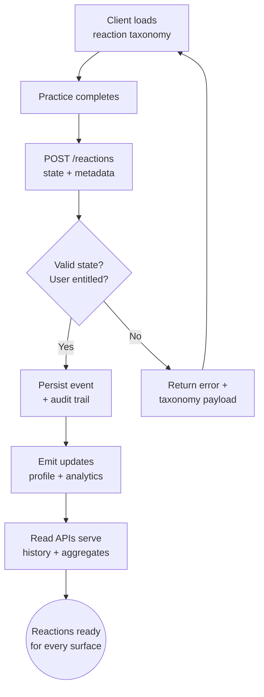

import FeatureSummary from '@site/src/components/FeatureSummary';

# Practices Reactions Base

## Summary

<FeatureSummary />

## Narrative
Practices Reactions Base is the canonical backend for the seven-state emotion model in v0.2. It stores the localized taxonomy, validates every reaction submit, and keeps profile, history, analytics, and notification pipelines in lockstep with the same identifiers.

The service ingests events, fans them out to downstream caches, and exposes read APIs for user history or practice aggregates while versioning schema changes. All definitions flow directly from the [Reactions Taxonomy](/docs/wiki/reactions/), so labels and colours stay consistent across CMS, app clients, and analytics.

## Interaction
1. Client requests `GET /reactions/taxonomy` during app boot; service returns the seven normalized states with localized names, descriptions, and color tokens.
2. After a practice, client submits `POST /reactions` with user id, practice id, state key, optional intensity, and note metadata.
3. Service validates: user entitlement, practice session existence, taxonomy key, and rate limits; on success, persists the reaction event with audit metadata.
4. Event fan-out publishes to stream consumers: profile summary cache invalidation, analytics pipeline, notification engine (for tips or follow-up content).
5. Read-side endpoints expose history (`GET /users/{id}/reactions?range=30d`), practice aggregates (`GET /practices/{id}/reactions?granularity=weekly`), and master dashboards.
6. Taxonomy admins (via CMS) update labels or color tokens; the service versions the taxonomy and ensures old records map cleanly for historical queries.

:::caution Edge Case
If a client submits a reaction with a deprecated state key, the service returns a 409 with the active taxonomy and logs the incident; it never silently remaps values to avoid data drift.
:::

:::tip Signals of Success
- Reaction taxonomy responses stay under 200 ms p95 even during peak app launches.
- ≥99% of practice completions result in a stored reaction event.
- Downstream caches invalidate within seconds so profile dashboards reflect new reactions immediately.
:::

### Journey

## Requirements
- **Acceptance criteria**
  - GIVEN the app requests the taxonomy WHEN the service responds THEN it returns seven states with ids, localized strings, colors, and version metadata.
  - GIVEN a practice completion WHEN the user submits a reaction THEN the service validates, stores the event, and emits downstream updates within five seconds.
  - GIVEN an analyst queries aggregates WHEN results stream back THEN they include historical data regardless of taxonomy renames and respect user privacy scopes.
- **No-gos & risks**
  - Allowing clients to create ad-hoc states—taxonomy changes must flow through the CMS to maintain consistency.
  - Storing reactions without session validation which could inflate metrics or leak data.
  - Blocking UI due to slow writes; ingestion should be resilient with retry logic and dead-letter queues.

## Data
- Primary metric: Percentage of practice sessions with a successfully stored reaction (target ≥99%).
- Secondary checks: Taxonomy fetch latency, stream replication lag, data quality audits comparing ingestion vs analytics warehouse counts.
- Telemetry requirements: Log taxonomy version served, reaction ingestion outcomes (success/validation failure), stream delivery metrics, and aggregate query performance.

## Open Questions
- Do we need per-user reaction deletion tooling for GDPR requests before 1.0?
- Should we expose percentile-based APIs (e.g., top three states) or keep logic client-side?
- How do we handle multi-select or notes attachments if the taxonomy expands in later releases?
