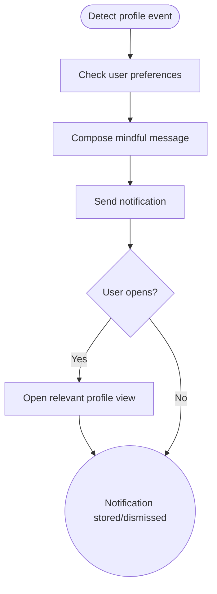

import FeatureSummary from '@site/src/components/FeatureSummary';

# Profile Notifications

## One-Glance Summary

<FeatureSummary />

## Narrative
Profile Notifications close the loop on personal milestones. Whether someone reacts to your practice, a mission unlocks, or AWAunits arrive, timely updates sustain motivation. Messaging must remain gentle and context-rich, matching user preferences configured in Push Notification Settings.

## Interaction Blueprint
1. Listen for profile events from engagement services (mentions, achievements, invitations).
2. Package notifications with concise copy, mindful tone, and helpful metadata.
3. Respect category preferences and quiet hours before scheduling delivery.
4. Deliver via push or in-app inbox, handling offline scenarios gracefully.
5. Deeplink to the appropriate section (profile summary, notifications hub) when tapped.
6. Track dismissals and follow-up actions to refine relevance.

- Edge case: High event volume could overwhelm; batch similar notifications or summarize to prevent fatigue.

- Signals of success:
  - High open rates with corresponding in-app action (e.g., checking profile updates).
  - Minimal opt-outs attributed to profile notifications.
  - Accurate deeplinks that land users on the expected screen.

### Mermaid Journey IN MERMAID FORMAT

## Requirements & Guardrails
- **Acceptance criteria**
  - GIVEN a qualifying event WHEN preferences allow THEN a notification sends within the defined latency.
  - GIVEN a user taps the notification WHEN the app opens THEN it navigates directly to the related content.
  - GIVEN the user silences a category WHEN the next event fires THEN no message is sent.
- **No-gos & risks**
  - Generic copy that fails to convey context or gratitude.
  - Over-notifying for minor events leading to fatigue.
  - Links that open to dead ends or require additional navigation.

## Data & Measurement
- Primary metric: Notification open rate for profile-related messages.
- Secondary checks: Opt-out rate, follow-up actions taken, and negative feedback submissions.
- Telemetry requirements: Log event trigger, send outcome, delivery receipts, and deeplink success.

## Open Questions
- Should we introduce a digest option for users who prefer fewer notifications?
- How do we sequence profile notifications alongside Pulse or practice reminders to avoid overlap?
