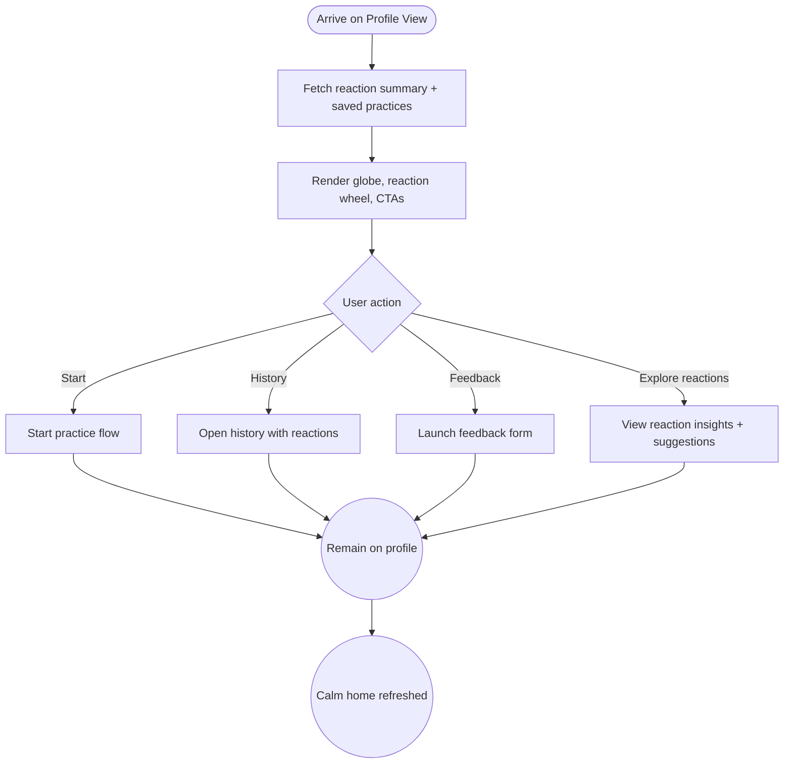

import FeatureSummary from '@site/src/components/FeatureSummary';

# Profile View v0.2

## Summary

<FeatureSummary />

## Narrative
Profile View v0.2 keeps the calm hero from v0.1 and layers in the new reaction-powered insights. The greeting header and globe remain the anchor, yet a reaction wheel now sits beneath the light, showing the user’s dominant states over the past week. Each slice maps to the seven-color taxonomy, animating gently when new reactions arrive. Tapping a slice opens detail cards that recommend practices to balance or deepen that feeling.

Next to the reactions card, users see quick actions: “Continue practice,” “Saved favourites,” and “Leave feedback.” Reaction-aware badges highlight when the system suggests grounding or energizing options based on recent selections. Notifications stay inline, and a new release banner appears when the What’s New deck has unseen cards. The layout still resists clutter—modules expand on demand while preserving the breathable spacing that defines the home experience.

State names, colours, and copy mirror the [Reactions Taxonomy](/docs/wiki/reactions/) so the wheel, insights, and downstream nudges stay consistent with the rest of the product.

## Interaction
1. User lands on Profile View; the app fetches reaction summaries from Practices Reactions Base and hydrates the reaction wheel plus streak badges.
2. Reaction wheel displays dominant state (full-color arc) and up to two secondary states; tooltips explain what each state represents in localized language.
3. CTA row offers “Начать практику,” “Choose mood practice,” and “See history,” with subtle highlights based on the user’s current reaction mix.
4. Saved practice pills appear if the user long-pressed a card to favourite it; selecting opens the practice pre-filled with last-used settings.
5. Feedback button opens the new Leave Feedback flow; submitting logs to support while tagging the current dominant state for context.
6. Light Ignition hue reflects the dominant state, blending seamlessly with the reaction wheel; timers animate the fade as 24 hours elapse.

:::caution Edge Case
If reaction data fails to load, show a calm placeholder card (“We’ll show your feelings once you finish a practice”) and keep CTAs accessible; never block the user from starting a session.
:::

:::tip Signals of Success
- Users engage with the reaction wheel (tap rate ≥40%) and choose suggested practices tied to their current mood.
- Feedback submissions include reaction context, helping the team understand sentiment.
- Despite new modules, time-to-first-CTA tap remains under one minute.
:::

### Journey

## Requirements
- **Acceptance criteria**
  - GIVEN the user lands on Profile View WHEN reaction data is available THEN the wheel displays dominant + secondary states with accurate counts and tooltips.
  - GIVEN the user taps a reaction slice WHEN suggestions exist THEN the app surfaces recommended practices filtered by that state.
  - GIVEN a practice is marked as favourite WHEN the user returns to Profile View THEN the saved pill appears with last-used configuration.
  - GIVEN reaction data fails WHEN the network call errors THEN the placeholder card displays, telemetry logs the failure, and CTAs remain usable.
- **No-gos & risks**
  - Overloading the home surface with charts; keep modules calm, tappable, and optional.
  - Showing inconsistent state colors between reaction wheel and Light Ignition.
  - Surfacing sensitive insights without clear language; copy must feel supportive.

## Data
- Primary metric: Reaction module engagement (unique taps ÷ Profile View sessions).
- Secondary checks: Conversion from suggested practices, feedback submissions tagged with reactions, and favourite usage frequency.
- Telemetry requirements: Log reaction summary payload versions, wheel impressions, slice taps, suggestion launches, favourite interactions, and fallback states.

## Open Questions
- Should we let users collapse the reaction module if they prefer a minimal home?
- Do we surface weekly email summaries tied to the same data or keep the insight in-app?
- How do we visualise longer-term trends (30-day shifts) without overwhelming the main view?
