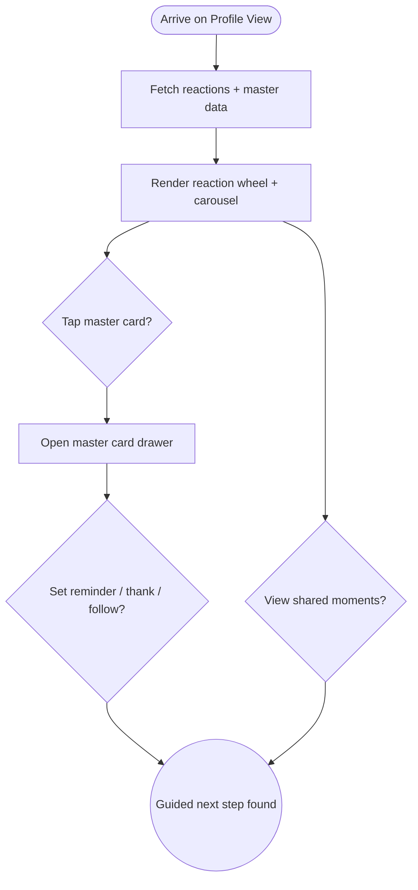

import FeatureSummary from '@site/src/components/FeatureSummary';

# Profile View v0.3 (Masters & Reactions)

## Summary

<FeatureSummary />

## Narrative
Profile View v0.3 keeps the greeting hero + reaction wheel and now slides in a master carousel right under the light. Followed masters appear first, balanced/recommended masters follow, and each tile mirrors the colours from [Master Cards](/docs/features/master-card-bio-v0-3.md) so the experience feels cohesive.

History gains a “Shared moments” filter for collectives, and quick actions adapt ("Thank Anna", "Explore new guides") without crowding the layout. Everything continues to read the same taxonomy data from [Practices Reactions Base](/docs/features/practices-reactions-base.md), so colours and copy remain aligned.

## Interaction
1. User lands on Profile View; app fetches reaction summaries, followed masters, and upcoming collective metadata.
2. Reaction wheel renders with weekly trend sparkline; tapping enters the detail drawer.
3. Master carousel displays followed masters first, then recommended ones sorted by upcoming start times and language preference.
4. Each card includes "Set reminder," "Add to calendar," and "Thank" actions when relevant.
5. "Shared moments" filter toggles the history list to show only collective entries with reaction deltas.
6. If the user unfollows a master, the card fades out and the carousel snaps to the next recommendation gracefully.

:::caution Edge Case
When no collectives are scheduled, replace the carousel with a calm placeholder rather than leaving empty space—invite the user to explore the catalogue instead.
:::

:::tip Signals of Success
- Reaction-aware recommendations drive attendance to aligned collectives.
- Users consistently use the "Shared moments" filter to reflect on how master sessions felt.
- Follow/unfollow interactions sync across Home View and Practice List without lag.
:::

### Journey

## Requirements
- **Acceptance criteria**
  - GIVEN reaction data WHEN the user opens profile THEN the carousel prioritises masters whose sessions match or balance the current dominant state.
  - GIVEN the user sets a reminder or follows a master WHEN the action completes THEN badges update instantly and Home View rings reflect the change.
  - GIVEN collective history exists WHEN "Shared moments" is toggled THEN entries show pre/post reaction info and link to practice replays.
- **No-gos & risks**
  - Overcrowding the hero with too many modules; maintain breathing room and respect calm tone.
  - Recommendation logic that ignores language preferences or upcoming availability.
  - State mismatches between profile and home announcements creating confusion.
## Data
- **Primary metric:** Carousel engagement (orb taps ÷ Profile View sessions) and reminder conversions triggered from the carousel.
- **Secondary checks:** Shared moments filter usage, thank-you sends, follow/unfollow taps, and reaction-wheel interactions.
- **Telemetry requirements:** Log payload hashes, carousel ordering, CTA taps, reminder toggles, gratitude submissions, and history-filter states.

## Open Questions
- Should we allow manual pinning of masters to keep them at the front of the carousel regardless of recommendations?
- Do we show master-specific streaks (e.g., how many times practiced with Anna) in v0.3 or save for later analytics?
- How do we support accessibility for the carousel (e.g., voiceover descriptions per card)?
