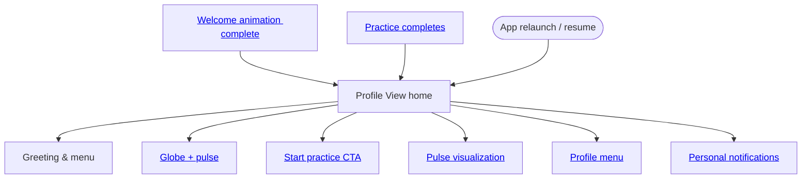

import FeatureSummary from '@site/src/components/FeatureSummary';

# Profile View

## Summary

<FeatureSummary />

## Narrative
Profile View is the AWATERRA home page. The welcome animation dissolves into this surface, every practice completion returns here, and relaunching the app anchors the user in the same calm hub. The header greets the user by name on the left while the profile menu button waits on the right. The center of the canvas showcases the living [Globe](./globe.md) with the user's [AWA Pulse](./awa-pulse-basic.md): the light stays bright for 24 hours after each practice, then softens to a glimmer until the next ignition. The primary call-to-action invites them to start the next practice before the glow fades.

The layout stays focused: greeting, menu, globe, pulse visualization, and practice CTA. Personal notifications from [Profile Notifications](./profile-notifications.md) sit within reach, and the [layout menu](./layout-menu.md) keeps deeper navigation one tap away. Everything refreshes in place so the user always knows where to begin, continue, or reflect without extra screens.

## Interaction
1. Land the user on Profile View after onboarding, practice completion, or app relaunch, restoring their place in the home experience.
2. Render the header with the greeting on the left and the menu/profile button on the right, mirroring the latest name or identity state.
3. Keep the [Globe](./globe.md) centered with the user's pulse visualization layered above; show the bright state during the 24-hour burn window and soften it gently when the timer lapses.
4. Present the primary CTA row directly under the globe—`Начать практику` routes to the [Practice Screen](./practice-screen.md), while secondary actions surface saved rituals or breathers.
5. Surface the latest personal notifications inline with the CTA row and deep-link them to [profile notifications](./profile-notifications.md), highlighting fading-light nudges when the timer is near its end.
6. Keep the [layout menu](./layout-menu.md) accessible from the header button for profile settings and navigation, including quick access to [Application Settings](./application-settings.md).
7. Persist the home state so returning users drop back into Profile View instantly, even after backgrounding the app.

:::caution Edge Case
Notifications spike during live events. Tuck them into a calm card under the globe and let the user expand for more instead of flooding the header.
:::

:::tip Signals of Success
- Most home sessions tap `Начать практику` or another CTA within a minute.
- Personal notifications receive healthy open rates without denting session calm.
- Return sessions consistently rehydrate Profile View without flashes or route jumps.
:::

### Journey

## Requirements
- **Acceptance criteria**
  - GIVEN the welcome animation completes WHEN the dissolve finishes THEN Profile View loads within a beat and reflects the user's greeting and latest stats.
  - GIVEN the user taps the menu button WHEN on Profile View THEN profile settings open without leaving the home context.
  - GIVEN the user taps `Начать практику` WHEN on Profile View THEN the app routes directly to the Practice Screen without intermediate blockers.
  - GIVEN personal notifications arrive WHEN the user is on Profile View THEN they appear in the inline list and open the corresponding detail when tapped.
- **No-gos & risks**
  - Redirecting users to secondary screens after onboarding or practice completion.
  - Delayed globe or pulse renders that recreate a loading screen feeling.
  - Overwhelming the home surface with pop-ups or interruptive modals.

## Data
- Primary metric: Percentage of home sessions that trigger a primary action (start practice or open menu) within the first minute.
- Secondary checks: Notification open rate from Profile View, menu engagement, and repeat visits to the home surface.
- Telemetry requirements: Log Profile View entry source (onboarding, practice, relaunch), menu taps, notification opens, CTA usage, and time to exit.

## Open Questions
- Should Profile View adapt modules based on time of day or recent practice type in v0.1?
- How do we surface community updates without disrupting the calm home experience?
