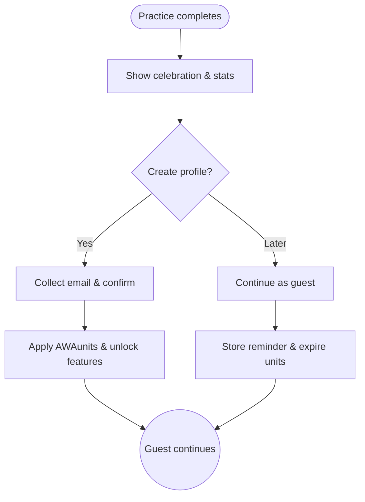

import FeatureSummary from '@site/src/components/FeatureSummary';

# Profile View

## Summary

<FeatureSummary />

## Narrative
Profile View is the moment guests feel the impact of their first practice and can join the community fully. The screen glows with gratitude, recaps contributions, and invites profile creation to save AWAunits, streaks, and deeper features.

The flow respects choice. Users can celebrate and continue as guests while seeing a clear summary of what they miss by not saving progress, reinforced with gentle animation.

## Interaction
1. Trigger the completion animation and summary after a guest practice ends.
2. Display achievements: Pulse contribution, AWAunits earned, and heartfelt gratitude.
3. Present primary CTA “Create profile” alongside a secondary “Later” option.
4. If the user selects Create profile, collect email verification and finalize account creation.
5. If they defer, clarify that earned AWAunits will expire and provide gentle reminders.
6. Update access permissions: unlock missions, masters, and progress tracking for registered members; gate for guests.

:::caution Edge Case
User dismisses the modal accidentally. Resurface the invitation in the profile tab without blocking core usage.
:::

:::tip Signals of Success
- Conversion rate from guest to registered climbs after the first practice.
- Feedback shows users understand the benefits of creating a profile.
- No duplicate accounts appear when users retry the flow.
:::

### Journey

## Requirements
- **Acceptance criteria**
  - GIVEN a guest completes a practice WHEN the summary appears THEN both CTAs are visible and accessible.
  - GIVEN the user registers WHEN verification completes THEN previously earned AWAunits and progress are retained.
  - GIVEN the user defers WHEN 24 hours pass THEN a gentle reminder nudges them without spamming.
- **No-gos & risks**
  - Hard-blocking guests from exploring core content before they’re ready to commit.
  - Losing earned rewards during registration due to race conditions.
  - Copy that feels manipulative or guilt-inducing contrary to brand tone.

## Data
- Primary metric: Conversion rate from guest to registered profile after the first session.
- Secondary checks: AWAunit retention vs. expiration, frequency of reminder prompts, and feature tap-throughs requiring a profile.
- Telemetry requirements: Log modal views, CTA selections, registration completion, and deferral reminders.

## Open Questions
- Should we offer social sign-in at launch or keep email-only to reduce complexity?
- How do we personalize follow-up messaging based on why a user deferred (e.g., time, trust, readiness)?
