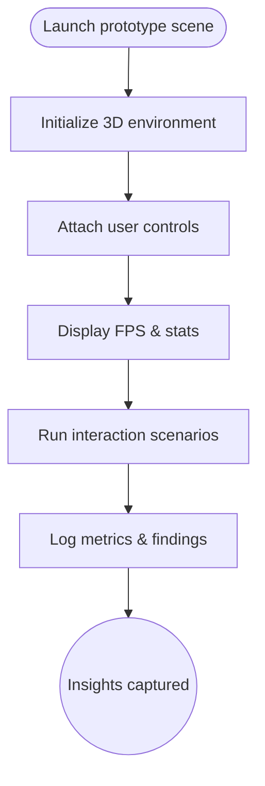

import FeatureSummary from '@site/src/components/FeatureSummary';

# Prototype 3D Map with FPS Stats

## One-Glance Summary

<FeatureSummary />

## Narrative
The Prototype 3D Map with FPS Stats is our sandbox for testing rendering, controls, and telemetry before the full Light Map launch. It exposes navigation, zoom, and overlays while surfacing performance metrics so engineering can tune shaders and pipelines.

Even as an internal tool it mirrors the future experience with smooth interaction and clear orientation, helping stakeholders feel the spatial story we plan to ship.

## Interaction Blueprint
1. Load prototype assets and initialize the 3D scene with target shaders and lighting.
2. Render the practice plane and attach navigation controls (pan, zoom, rotate) tuned for device input.
3. Instrument frame timing and overlay FPS along with key resource stats.
4. Stream user inputs and environment data to validate crash-free stability over extended sessions.
5. Capture recordings or screenshots for stakeholder review and documentation.
6. Export performance logs and summarize findings to inform optimization backlog.

:::caution Edge Case
Low-end devices dip below target FPS. Provide quality toggles or simplified rendering paths so evaluation can continue.
:::

:::tip Signals of Success
- Frame rate stays within target thresholds during interaction loops.
- Extended test sessions complete without crashes or visual glitches.
- Performance insights flow into the production roadmap.
:::

### Journey

## Requirements & Guardrails
- **Acceptance criteria**
  - GIVEN the prototype loads WHEN a tester interacts THEN FPS counter and controls respond without stutter.
  - GIVEN extended usage WHEN logs are captured THEN memory usage stays within safe thresholds and no crashes occur.
  - GIVEN stakeholders request evidence WHEN playback assets are generated THEN recordings illustrate both visuals and performance.
- **No-gos & risks**
  - Ignoring thermal or battery impact could mislead production expectations.
  - Using placeholder assets that differ greatly from planned fidelity undermines the exercise.
  - Failing to document findings slows optimization cycles.

## Data & Measurement
- Primary metric: Median FPS during scripted interaction scenarios (rotate, zoom, data overlay).
- Secondary checks: Crash-free rate over 24h burn-in, GPU/CPU utilization, and memory headroom.
- Telemetry requirements: Log per-frame timing, resource usage, camera path events, and any runtime warnings.

## Open Questions
- Do we keep the FPS overlay in production for debugging or remove before public release?
- Which rendering optimizations deliver the greatest benefit without compromising visual storytelling?
