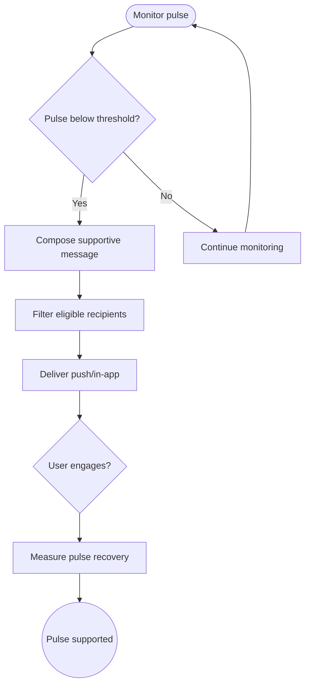

import FeatureSummary from '@site/src/components/FeatureSummary';

# PUSH/INAPP: AWA Pulse Goes Down

## Summary

<FeatureSummary />

## Narrative
This engagement play keeps the community responsive. When AWA Pulse dips, a mindful notification invites practitioners to contribute a practice, share energy, or send encouragement.

Copy balances urgency with compassion using lines like “The pulse is gentle right now, can you help?” so shared responsibility stays warm, not guilty.

## Interaction
1. Monitor pulse analytics service for threshold breaches sustained over the configured window.
2. Enrich the event with context (current pulse, suggested actions, recent contributors).
3. Segment audiences based on notification preferences and quiet hours.
4. Deliver push or in-app message with clear CTA (Start a practice, Share encouragement).
5. Track opens, conversions, and resulting pulse recovery.
6. Suppress duplicate sends until the pulse stabilizes or a cooldown expires.

:::caution Edge Case
Pulse fluctuates rapidly around the threshold. Introduce hysteresis to avoid spam.
:::

:::tip Signals of Success
- Practice starts increase after alerts.
- Opt-out rates stay low because tone remains balanced.
- Pulse recovers within the target timeframe thanks to community action.
:::

### Journey

## Requirements
- **Acceptance criteria**
  - GIVEN a sustained drop WHEN detected THEN a single notification dispatches with contextual CTA.
  - GIVEN quiet hours or mute WHEN active THEN users are excluded from the send.
  - GIVEN recovery WHEN pulse returns above threshold THEN follow-up communications celebrate the community response.
- **No-gos & risks**
  - Crying wolf with frequent alerts undermines trust.
  - Using fear-based copy that clashes with AWATERRA’s supportive ethos.
  - Failing to respect user preferences from Push Notification Settings.

## Data
- Primary metric: Practice participation uplift within 2 hours of the alert.
- Secondary checks: Notification open/click-through rates, opt-outs, and pulse stability post-notification.
- Telemetry requirements: Log trigger time, message payload, segment size, delivery outcomes, and resulting pulse data.

## Open Questions
- Should we introduce tiers of alerts (gentle, urgent) or keep a single tone for v0.1?
- How do we coordinate with other campaigns to prevent overlapping notifications during quiet periods?
