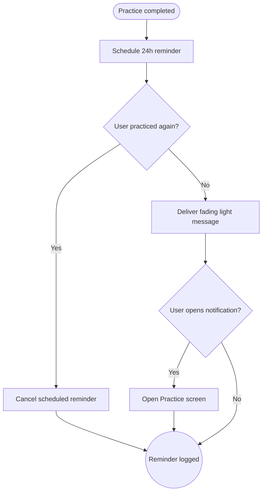

import FeatureSummary from '@site/src/components/FeatureSummary';

# PUSH/INAPP: Fading Light Reminder

## One-Glance Summary

<FeatureSummary />

## Narrative
The Fading Light Reminder is a gentle whisper: “Your light is dimming—ready to shine again?” It respects cadence, avoids pressure, and opens straight into Practice so users can reignite their presence. Tone is reflective, focusing on personal rhythm instead of streak anxiety.

## Interaction Blueprint
1. Schedule a reminder 24 hours after the last completed practice, respecting quiet hours and notification preferences.
2. Compose copy referencing the user’s contribution (“Your light still glows—keep it bright”).
3. Deliver via push and optionally in-app inbox for users who prefer ambient prompts.
4. Deep link to the Practices List or a personalized recommendation when opened.
5. Track completion or snooze actions to refine future timing.
6. Cancel reminders if the user practices again before the 24-hour mark.

- Edge case: User already has multiple reminders queued; deduplicate to avoid stacking.

- Signals of success:
  - Re-engagement rate within 12 hours of receiving the reminder.
  - Low opt-out rates due to considerate tone and cadence.
  - Minimal support complaints about over-notification.

### Mermaid Journey IN MERMAID FORMAT

## Requirements & Guardrails
- **Acceptance criteria**
  - GIVEN a practice event WHEN logged THEN a reminder schedules exactly 24 hours later unless the user opts out.
  - GIVEN a user practices again before the reminder WHEN scheduler checks THEN it cancels the pending send.
  - GIVEN the reminder fires WHEN tapped THEN the app opens directly to a relevant practice entry point.
- **No-gos & risks**
  - Sending reminders during quiet hours or multiple times in a day.
  - Using guilt-based messaging inconsistent with AWATERRA’s supportive tone.
  - Failing to respect category opt-outs managed in settings.

## Data & Measurement
- Primary metric: Practice restart rate attributable to the reminder.
- Secondary checks: Notification open rate, snooze/disable rate, and qualitative sentiment in feedback channels.
- Telemetry requirements: Log scheduling, cancellation, delivery outcomes, opens, and follow-up practice completion.

## Open Questions
- Should we personalize timing (e.g., weekend vs. weekday) based on user behavior in future iterations?
- Do we follow up with a softer nudge if the user ignores multiple reminders in a row?
