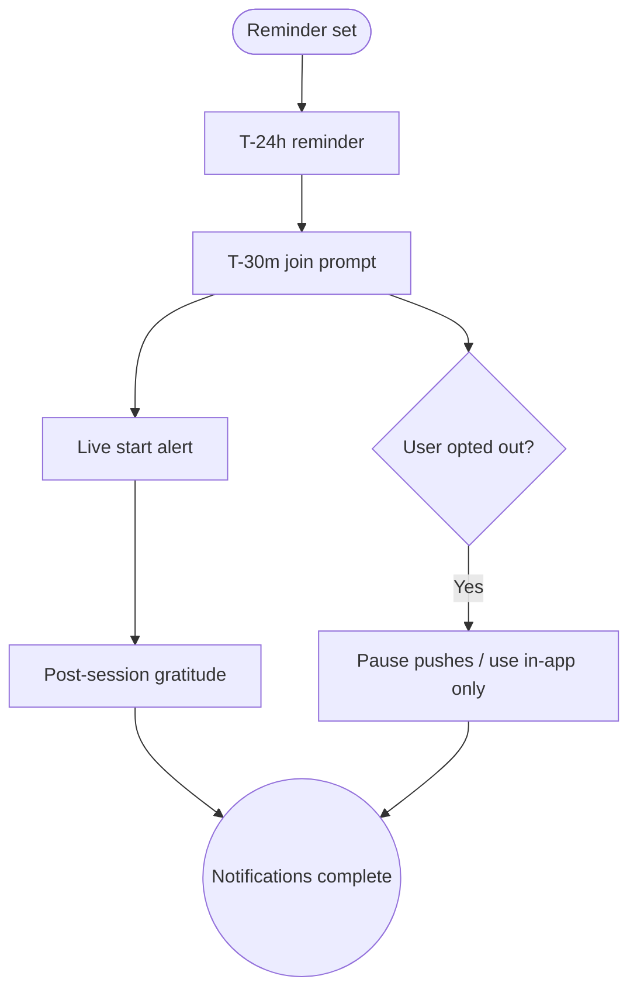

import FeatureSummary from '@site/src/components/FeatureSummary';

# Push & In-App Notifications v0.3 (Masters)

## Summary

<FeatureSummary />

## Narrative
Notifications gain a master cadence: schedule confirmation, pre-session anticipation, live alert, and post-session gratitude. When a user sets a reminder from Home View or Practice List, the system stores preferred channels (push, email, in-app). At T-24h a calm push offers a calendar add; at T-30m, a richer push arrives—"Collective cleansing with Master Anna starts soon"—with options to join, snooze, or opt out. If the user opens the app, a matching in-app banner appears anchored beneath the story rings.

At start, a concise push invites immediate action; if the user is already in-app, the banner converts into the "Join now" CTA that opens the visualization screen. After the session, participants receive a soft thank-you prompt: "How did the practice feel? Share a reaction and thank Anna." Cooldown logic prevents multiple pushes within short windows, and unsubscribed users still see in-app banners without receiving push.

## Interaction
1. Reminder toggle writes preference to notification service with master ID and session time.
2. T-24h push triggers for opted-in users with add-to-calendar deep link; in-app card appears on next launch.
3. T-30m push/banners highlight countdown and "I’m ready" CTA; snooze option defers to T-10m.
4. Session start triggers live push for those who haven’t joined yet; if they’re inside the app, a modal invites them into the practice screen.
5. Post-session (T+5m) gratitude push goes only to attendees, encouraging reactions and thank-you message.
6. If the user ignores two pushes consecutively, the system pauses future pushes and relies on in-app banners until re-opt-in.

:::caution Edge Case
Ensure timezone handling is robust—reminders should respect the user’s locale even when the master operates elsewhere.
:::

:::tip Signals of Success
- Reminder pushes drive high tap-through into the visualization screen within two minutes of receipt.
- Gratitude prompts lead to meaningful thank-you messages rather than opt-outs.
- Snooze usage stays healthy, signalling we are respectful of users’ schedules.
:::

### Journey

## Requirements
- **Acceptance criteria**
  - GIVEN a user opts into reminders WHEN the collective approaches THEN pushes fire at T-24h and T-30m with correct deep links and localisation.
  - GIVEN the session starts WHEN the user has not joined THEN the live push includes "Join now" action that opens the visualization screen.
  - GIVEN the user attends WHEN the session ends THEN a gratitude push/in-app card prompts for reaction feedback and thank-you message.
- **No-gos & risks**
  - Spamming users who snoozed or skipped; respect cooldown rules (no more than one push every 3h unless user joins).
  - Missing localisation or incorrect time conversions leading to late reminders.
  - Sending gratitude pushes to non-attendees, creating confusion.
## Data
- **Primary metric:** Reminder push open/tap-through rate into the visualization screen.
- **Secondary checks:** Opt-in/opt-out deltas, snooze usage, gratitude completion rate post-session, and localisation accuracy (errors flagged).
- **Telemetry requirements:** Log reminder preference changes, send vs deliver timestamps, action taps (join/snooze/dismiss), gratitude payloads, and cooldown suppressions.

## Open Questions
- Should we allow users to choose channel intensity (push + email vs push only) per master?
- Do we auto-disable reminders after multiple missed sessions, or simply suggest review in settings?
- How do we coordinate with OS-level focus modes to avoid sending pushes during designated quiet times?
