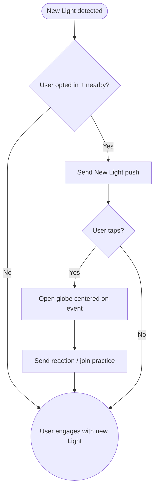

import FeatureSummary from '@site/src/components/FeatureSummary';

# PUSH: New Light Near You

## Summary

<FeatureSummary />

## Narrative
“New Light Near You” celebrates community density by alerting users when another practitioner lights up nearby. The push references the map layer and encourages users to open the globe to see the new spark, join a relevant practice, or send supportive energy. Privacy safeguards ensure locations remain fuzzy and opt-in.

## Interaction
1. Map service detects a new active Light (practice start) within a configurable radius of the user’s coarse location.
2. Eligibility checks confirm the user opted into proximity notifications and isn’t currently practicing.
3. Push sends with copy like “A new Light just ignited near Berlin. Tap to welcome them.”
4. Tapping opens the globe centered on the event or a curated feed.
5. Users can send a reaction, follow the master hosting the session, or jump into the same practice if still live.
6. Frequency caps prevent over-notification in dense areas.
7. Users manage this notification from privacy settings.

:::caution Edge Case
If the user’s location services are disabled, suppress the push and surface a prompt encouraging them to enable coarse location rather than sending stale data.
:::

:::tip Signals of Success
- Users feel a sense of community and re-enter the app after receiving the push.
- Privacy complaints remain nonexistent due to fuzzed radius and opt-in.
- Notification cadence stays within defined limits.
:::

## Journey

## Requirements
- **Acceptance criteria**
  - GIVEN a new Light ignites within radius WHEN permissions allow THEN send a push containing generalized location and CTA.
  - GIVEN the user taps the push WHEN the map opens THEN it centers roughly on the event without revealing precise coordinates.
  - GIVEN the user disables the feature WHEN settings update THEN proximity pushes immediately stop.
- **No-gos & risks**
  - Revealing exact locations could violate privacy; apply fuzzing and consent.
  - Overlapping pushes in dense cities risk spam; add per-day caps.
  - Geolocation must respect OS policies; fall back gracefully if permissions revoked.

## Data
- **Primary metric:** Tap-through rate of proximity pushes.
- **Secondary checks:** Opt-in/out counts, complaints, average radius triggered, follow-up actions (join, reaction), and suppression rates due to disabled location.
- **Telemetry requirements:** Log anonymized region, push ID, send/tap timestamps, outcome events, suppression reasons, and frequency cap hits.

## Open Questions
- Do we allow users to set custom radii or rely on system defaults?
- Should we batch nearby events (“Three lights ignited nearby”) to reduce push volume?
