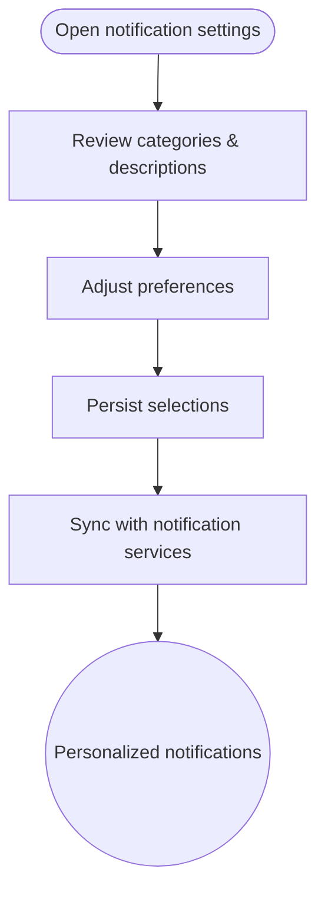

import FeatureSummary from '@site/src/components/FeatureSummary';

# Push Notification Settings

## One-Glance Summary

<FeatureSummary />

## Narrative
Push Notification Settings let practitioners choose the rhythms that serve them. Users can enable categories such as practice reminders, pulse alerts, and profile updates while silencing ones that do not fit.

Transparent descriptions and synced preferences across devices keep communication mindful and aligned with consent.

## Interaction Blueprint
1. Surface settings entry points from Profile and contextual nudges.
2. Display available categories with clear copy and default recommendations.
3. Persist toggles locally and via backend so preferences apply to all channels.
4. Reflect current OS-level permission status and guide users if notifications are disabled globally.
5. Provide quick controls for muting all notifications temporarily.
6. Log changes and respect them immediately across push, in-app, and email systems.

:::caution Edge Case
OS-level permission is revoked. Show an inline warning and link to system settings without breaking the flow.
:::

:::tip Signals of Success
- Delivered messages match the categories users configure.
- Opt-out or uninstall rates tied to notification fatigue go down.
- Support requests about unwanted notifications trend downward.
:::

### Journey

## Requirements & Guardrails
- **Acceptance criteria**
  - GIVEN a user toggles a category WHEN changes save THEN the backend updates before the next notification cycle.
  - GIVEN OS-level permissions are disabled WHEN settings screen loads THEN it surfaces guidance to re-enable or keep muted.
  - GIVEN a user requests “Mute all” WHEN activated THEN no category messages send until the mute expires or is turned off.
- **No-gos & risks**
  - Hiding how data is used for personalization; transparency is essential.
  - Defaulting to all categories ON without explaining impact.
  - Delayed synchronization leading to unwanted messages after preferences change.

## Data & Measurement
- Primary metric: Notification opt-in retention rate after preference adjustments.
- Secondary checks: Category enablement distribution, mute duration usage, and support contacts about notifications.
- Telemetry requirements: Log setting views, toggle events, sync outcomes, and notification send attempts blocked by preferences.

## Open Questions
- Do we expose scheduling controls (quiet hours) in v0.1 or wait for a later iteration?
- How should preferences propagate to email or SMS channels if we add them post-launch?
