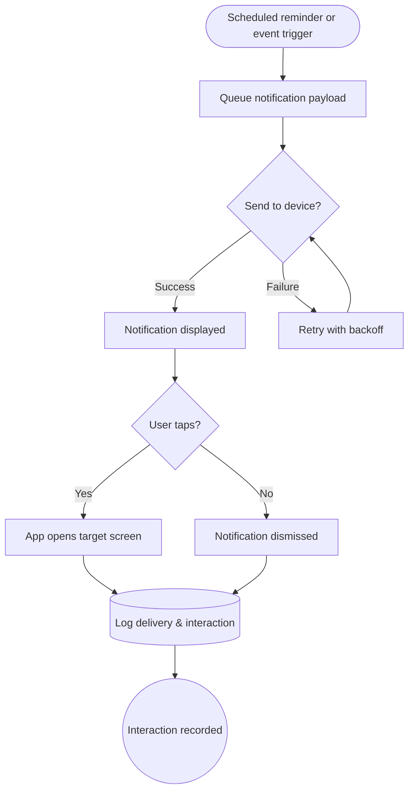

import FeatureSummary from '@site/src/components/FeatureSummary';

# Push Notifications

## One-Glance Summary

<FeatureSummary />

## Narrative
Push Notifications help practitioners stay aware of their next step. When a schedule or event fires, the system sends a calm prompt that encourages practice without pressure.

The flow guides the user from the lock screen into the right screen inside the app. We track each delivery and response so timing and content stay useful.

## Interaction Blueprint
1. System evaluates schedule and user events to queue a notification.
2. Notification service dispatches the message to the device.
3. User sees the notification on their home or lock screen.
4. User taps to open, dismisses, or swipes away the notification.
5. App deep-links to the intended destination and records the interaction.
6. Analytics pipeline logs delivery and engagement for reporting.

:::caution Edge Case
Delivery fails because the device is offline. The system retries automatically and flags the notification for follow-up once the device reconnects.
:::

:::tip Signals of Success
- Users interact with timely prompts instead of ignoring them.
- Delivery and interaction logs confirm healthy reliability.
- Practice streaks and session completions rise for cohorts that receive messages.
:::

### Journey

## Requirements & Guardrails
- **Acceptance criteria**
  - GIVEN a scheduled reminder WHEN the reminder time arrives THEN the user receives a timely prompt that reflects their current journey.
  - GIVEN the user taps a notification WHEN AWATERRA opens THEN the experience lands on the promised destination and the engagement is recorded for reporting.
  - GIVEN the user cannot be reached on the first attempt WHEN the notification window is still active THEN the system automatically redelivers or escalates the issue to operations.
- **No-gos & risks**
  - Avoid over-sending that could feel spammy or induce opt-outs.
  - Ensure permission prompts follow platform guidelines to avoid rejection.
  - Protect personal data in transit and at rest to maintain trust.

## Data & Measurement
- Primary metric: Notification-engaged users per active day (target +15% vs control).
- Secondary checks: Opt-out rate, time-to-open distribution, practice completion delta for notified users.
- Telemetry requirements: Log delivery status, interaction type, and linked user/session metadata; align schema with analytics before launch.

## Open Questions
- What cadence should default reminder templates follow for new versus returning practitioners?
- Should we surface a user-facing history of recent notifications?
- How do we adapt content for different regions and languages?
