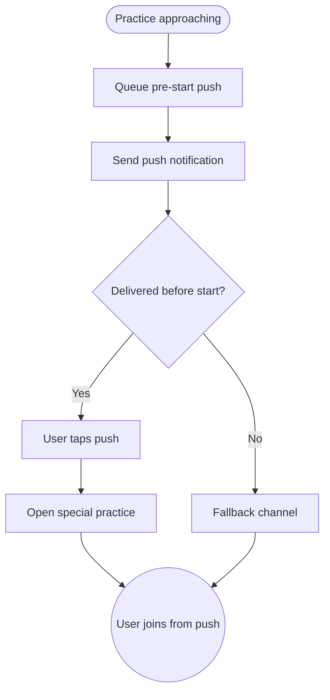

import FeatureSummary from '@site/src/components/FeatureSummary';

# Push Reminders Before Start (Special Practices, Paid)

## Summary

<FeatureSummary />

## Narrative
This feature focuses on the final-mile push notification that fires minutes before a paid special practice begins. It complements the broader subscription notifications by guaranteeing a just-in-time reminder with master name, practice title, and join link. Reliability is paramount—if the push fails, the perceived value of premium access drops.

## Interaction
1. Scheduler monitors upcoming paid special practices and enrolled users.
2. Exactly X minutes before start (configurable), send a push titled “Ready for [Master]’s special practice?” with join CTA.
3. Notification includes fallback copy in case the session is delayed.
4. User taps the push and lands directly in the live room or waiting screen.
5. If the practice is rescheduled or cancelled, send an updated push.
6. Delivery metrics feed into reliability dashboards.
7. If the user snoozes or dismisses repeatedly, adapt cadence or suggest unsubscribing.

:::caution Edge Case
When the app is already open, show an in-app banner instead of a push to avoid duplicates while still surfacing the reminder.
:::

:::tip Signals of Success
- Reminders arrive in the final minutes before start for >99% of enrolled users.
- Tap-through leads directly to the session without intermediate friction.
- Latency between send and delivery stays low.
:::

## Journey

## Requirements
- **Acceptance criteria**
  - GIVEN a user is enrolled WHEN the countdown hits the configured window THEN a push sends with master/practice context and join button.
  - GIVEN the user taps the push WHEN the session is live THEN they enter the practice immediately without extra navigation.
  - GIVEN delivery fails for a segment WHEN detection occurs THEN fallback actions trigger (e.g., resend, email) and metrics flag the incident.
- **No-gos & risks**
  - Sending pushes after the session begins frustrates users; monitor scheduler drift.
  - Not handling daylight savings/timezone shifts could create early/late reminders.
  - Duplicate pushes from multiple schedulers will be seen as spam.

## Data
- **Primary metric:** Push delivery success before start (p99).
- **Secondary checks:** Tap-through rate, join rate, failure reasons, snooze/dismiss frequency, and in-app banner fallback usage.
- **Telemetry requirements:** Log scheduled send time, actual send time, delivery latency, tap events, join events, snooze actions, and fallback channel usage.

## Open Questions
- Should we allow users to configure the pre-start window (e.g., 5 vs 15 minutes)?
- Do we add wearable notifications (watch, earbuds) for members who enable them?
