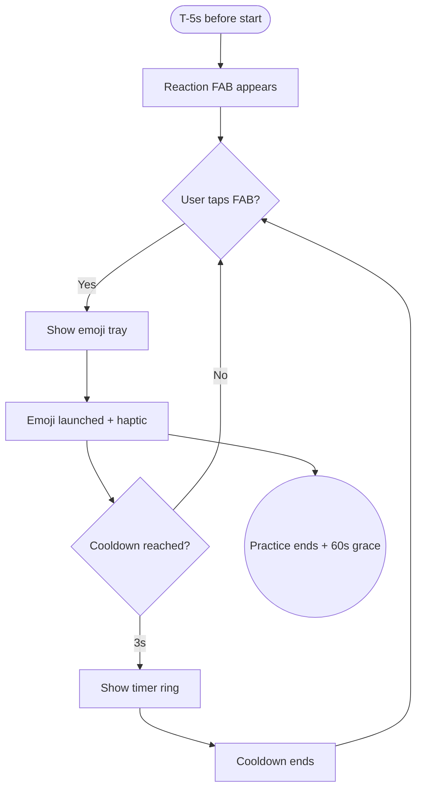

import FeatureSummary from '@site/src/components/FeatureSummary';

# Reactions v0.3 (Collective Masters)

## Summary

<FeatureSummary />

## Narrative
Reactions were redesigned for the collective brief: instead of static buttons, a floating action button blooms into a constellation of 7–10 curated states (Joy, Radiance, Release, Grounded, Peace, Insight, Unity, etc.). The tray stays hidden until five seconds before the session so the focus remains on settling in, then slides in with a soft breath animation. Each tap emits a 50 ms haptic pulse, plays a crystal chime whose volume scales with global send rate, and launches the emoji along a curved path into the master’s mini-map. When the emoji reaches centre, a subtle micro-flash signals the collective acknowledgement, visible to all attendees.

To maintain rhythm, each participant can send at most one emoji every three seconds. After ten sends, their FAB fades to translucent and shows a 30-second countdown ring; once cooled, it brightens again. The system aggregates totals in the background, feeding the live reaction dashboard on the visualization screen and the collective recap stats. If the practice extends, the tray stays responsive but continues to respect cooldowns.

## Interaction
1. Countdown hits T-5 seconds; reaction FAB animates into the lower-right corner.
2. User taps FAB; tray fans out with the curated emoji states (localised labels + colours).
3. Selecting an emoji triggers haptic + chime, increments personal counter, and emits the animation.
4. Shared reaction bar updates to show which state leads; participant counter reflects total sends.
5. If the user hits the 3-second cooldown, the FAB shows a shrinking ring; tapping is disabled until reset.
6. After ten sends, a 30-second cooldown overlay appears; once complete, the FAB returns to active state.

:::caution Edge Case
Handle accessibility gracefully—provide text-only labels and allow users to disable sound/haptics; otherwise reactions may exclude sensitive participants.
:::

:::tip Signals of Success
- Reaction cadence feels musical rather than frantic; cooldowns keep the experience intentional.
- Shared bar clearly communicates the prevailing emotional state.
- Users rarely hit frustration from disabled buttons because cues make cooldown timing obvious.
:::

### Journey

## Requirements
- **Acceptance criteria**
  - GIVEN the countdown reaches T-5 seconds WHEN the practice is about to start THEN the reaction FAB appears and remains until 60 seconds post-session.
  - GIVEN a user taps an emoji WHEN cooldown allows THEN the animation plays, shared totals update, and other attendees see the micro-flash.
  - GIVEN a user reaches ten reactions WITHOUT break THEN the FAB transitions to a 30-second rest state before reactivating.
- **No-gos & risks**
  - Allowing unlimited spam, which would overwhelm visuals and audio.
  - Sound cues that become harsh at scale; keep chimes soft even when many emojis fire.
  - Tray positions that interfere with core controls (pause, exit) on small screens.
- **Data**
  - Track reactions per user, cooldown hits, leading emoji state, global send rate, and opt-outs from sounds/haptics.

## Open Questions
- Should we support a "long-press" to send a stronger pulse (counting as multiple) or keep all sends equal for now?
- Do we expose a mute toggle directly on the tray or rely on global settings?
- How do we represent reactions for replay viewers—do they see archived particles or fresh interactions?
