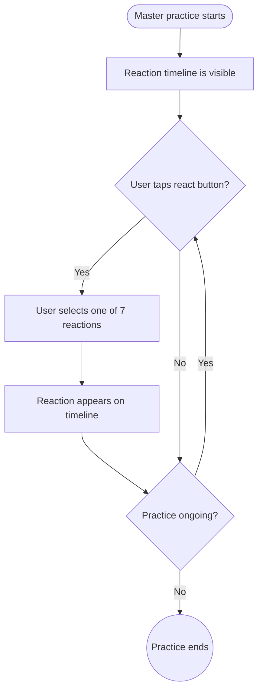

import FeatureSummary from '@site/src/components/FeatureSummary';

# Reactions v0.3 (Collective Masters)

## Summary

<FeatureSummary />

## Narrative
Reactions for master collectives are designed to capture the flow of feeling throughout a session. Instead of a single post-practice summary, participants can leave reactions at any point along the practice timeline, similar to commenting on a SoundCloud track. A calm, unobtrusive interface element allows users to select one of seven core states (Grounded, Joy, Energy, Peace, Release, Insight, Unity).

As reactions are added, they appear as markers on the session's progress bar. This creates a living emotional graph of the collective experience, visible to all participants in real-time. The visualization is intentionally gentle, using soft-hued icons to represent the different feelings, ensuring the focus remains on the practice itself. For session replays, the timeline shows all reactions from the live event, allowing users to feel the original collective energy and add their own.

## Interaction
1. When a master practice begins, a playback timeline appears at the bottom of the screen.
2. A subtle "react" button is visible near the timeline. Tapping it opens a small, calm palette of the seven reaction icons.
3. The user selects a reaction (e.g., "Insight"). The icon for that reaction gently appears on the timeline at the current timestamp.
4. The timeline populates with reactions from other participants in real-time, clustering them gracefully when many are shared at once.
5. Users can leave multiple reactions throughout the session, mapping their feelings to specific moments in the master's guidance.
6. The reaction interface remains available for 60 seconds after the practice audio ends to allow for final reflections.

:::caution Edge Case
Handle accessibility gracefully—provide text-only labels and allow users to disable sound/haptics; otherwise reactions may exclude sensitive participants.
:::

:::tip Signals of Success
- Reaction distribution on the timeline provides clear insights into which moments of a practice are most impactful.
- The experience feels connective and communal, not distracting or competitive.
- Users revisiting a session on replay report feeling more connected to the original live event.
:::

### Journey

## Requirements
- **Acceptance criteria**
  - GIVEN a master practice is active WHEN the user is participating THEN the reaction timeline is visible and interactive.
  - GIVEN a user taps the react button and selects a reaction WHEN submitted THEN their chosen reaction appears on the timeline at the corresponding timestamp, visible to them and other participants.
  - GIVEN a user is viewing a replay of a master practice WHEN they view the timeline THEN they can see all reactions left during the live session.
- **No-gos & risks**
  - Visuals or sounds that are distracting or break the calm, meditative state of the practice.
  - A complex or intrusive interface for leaving reactions.
  - Losing reaction data or timestamps, which would corrupt the integrity of the emotional journey.
## Data
- **Primary metric:** Reaction submissions per state per session (live vs replay).
- **Secondary checks:** Timeline density hotspots, cooldown effectiveness, accessibility opt-outs, and replay engagement with existing markers.
- **Telemetry requirements:** Log reaction timestamps, user/device context, palette usage, cooldown blocks, and replay reactivity events.

## Open Questions
- Should users be able to see who left a specific reaction, or should all reactions remain anonymous?
- How do we visualize a high density of reactions on the timeline without it becoming cluttered?
- Should we allow users to add a short note to their reaction?
