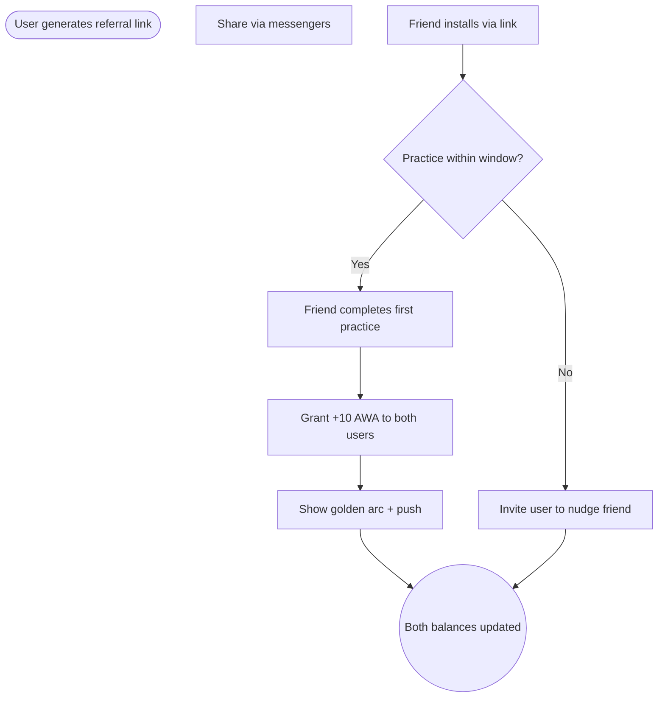

import FeatureSummary from '@site/src/components/FeatureSummary';

# Referral Program with Shareable Links

## Summary

<FeatureSummary />

## Narrative
Inviting friends becomes a mission of shared light. Users generate a personal referral link with CTA copy such as "Пригласи друга. Построй свое сообщество. Сделай свет ярче" and share it through messengers. When the friend installs the app through that link, they see contextual copy ("[Name] пригласил тебя зажечь свет") and begin their own journey.

Once the referred friend completes their first practice, both participants receive +10 Lumens, a golden arc appears between their points on the map, and both get a celebratory push: "Вы зажгли свет вместе!". The experience reinforces community growth along with tangible rewards.

## Interaction
1. User taps "Invite a friend" and we generate a unique referral link plus share sheet.
2. Friend installs the app via the link, sees the inviter's name, and creates an account.
3. Referral service tracks the friend through onboarding until they complete their first practice (the trigger event).
4. Once complete, ledger increments both inviter and invitee balances by +10 units with a referral reason code.
5. Map visualization draws the golden arc between their locations; notifications congratulate both users.
6. Referral dashboard updates to show status (Pending, Completed, Reward sent) so the inviter knows what happened.
7. Users can share multiple links, and cadence rules prevent spam by limiting invites per day.

:::caution Edge Case
If the referred friend never completes a practice within the grace window, the referral expires gracefully and the inviter sees guidance to nudge or invite someone else.
:::

:::tip Signals of Success
- Users share links and see friends convert to active practitioners.
- Referral rewards issue automatically with no manual adjustments.
- The map visualization and push copy make collaboration feel special.
:::

## Journey

## Requirements
- **Acceptance criteria**
  - GIVEN a friend installs via the unique link WHEN they complete their first practice THEN both accounts receive +10 units and see the celebration assets.
  - GIVEN a referral expires without practice WHEN the grace window closes THEN we notify the inviter and mark the attempt as expired without issuing units.
  - GIVEN multiple invites are sent WHEN the rate limit is exceeded THEN the UI communicates the cooldown period.
- **No-gos & risks**
  - Duplicate rewards or fraud (self-invites) must be detected via device/account checks.
  - Links lacking localized copy weaken the emotional impact in Russian-speaking markets.
  - Without transparency on referral status, users may flood support with "did it work?" requests.

## Data
- **Primary metric:** Conversion rate from shared link to first practice completion.
- **Secondary checks:** Average time from invite to completion, fraudulent referral detections, push engagement for celebratory copy, and grace-period expiry rate.
- **Telemetry requirements:** Log inviter ID, invitee ID, timestamps for link creation/install/practice, reward issuance, expiry reasons, and reminder nudges.

## Open Questions
- What is the ideal grace window before a referral expires?
- Do we show the golden arc only on the inviter's map or on both users' views simultaneously?
