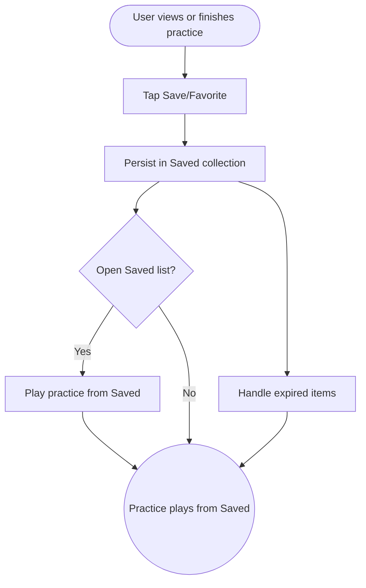

import FeatureSummary from '@site/src/components/FeatureSummary';

# Save Practice (Paid)

## Summary

<FeatureSummary />

## Narrative
Save Practice gives paid members a curated shelf of their most-loved sessions. Unlike Offline Mode (which handles downloads), this feature bookmarks up to a week of past sessions plus any of the seven base practices or “My Practice” templates. Users can mark favorites from practice cards or completion screens, view a "Most Saved" ranking, and jump back in with one tap.

Discovery insights:
- Users can choose from 7 preloaded practices, My Practice presets, or previously completed favorites.
- Favorites show on both the Practices tab and profile.
- Most Saved view ranks top ten practices across the community.

## Interaction
1. User taps the heart/save icon on a practice card or completion screen.
2. Practice metadata persists in the Saved list, optionally tagging whether it’s available offline.
3. Saved list surfaces in the Practices tab and Profile dashboard, grouped by recency and type.
4. Users can reorder, remove, or promote favorites to the top of the list.
5. Saved entries keep a short-lived archive (e.g., seven days) for recently completed sessions even if they’re not part of the base seven.
6. Community “Most Saved” module showcases top practices to inspire exploration.
7. When the user plays from Saved, playback respects offline/download state if available.

:::caution Edge Case
If a saved practice becomes unavailable (e.g., licensing window closed), display a toast explaining why and offer alternative suggestions instead of silently removing it.
:::

:::tip Signals of Success
- Paid users rely on the Saved shelf daily.
- Favorites sync across devices instantly.
- Community Most Saved insights drive practice discovery.
:::

## Journey

## Requirements
- **Acceptance criteria**
  - GIVEN a paid user saves a practice WHEN they switch devices THEN the Saved list remains in sync with accurate ordering.
  - GIVEN a saved session expires (older than policy) WHEN the app cleans up THEN the user receives a gentle note and can re-save if it returns.
  - GIVEN community Most Saved stats update WHEN users favorite content THEN the leaderboard reflects top 10 selections without exposing personal data.
- **No-gos & risks**
  - Blurring Save vs Offline may confuse users; keep copy clear (Save = quick access, Offline = download).
  - Unlimited saved slots could clutter the UI; enforce sensible limits or pagination.
  - Removing favorites silently erodes trust; always explain why.

## Data
- **Primary metric:** Number of saved-practice plays per paid user.
- **Secondary checks:** Sync latency, removal rate, Most Saved leaderboard freshness, duplicate entries, and fallback to alternatives.
- **Telemetry requirements:** Log save/unsave events, ordering changes, playback source (Saved vs catalogue), expired-item reasons, and toast displays when items become unavailable.

## Open Questions
- Do we cap the Saved list size or allow unlimited favorites for paid members?
- Should Most Saved highlight community-wide stats or personalize by locale/timezone?
