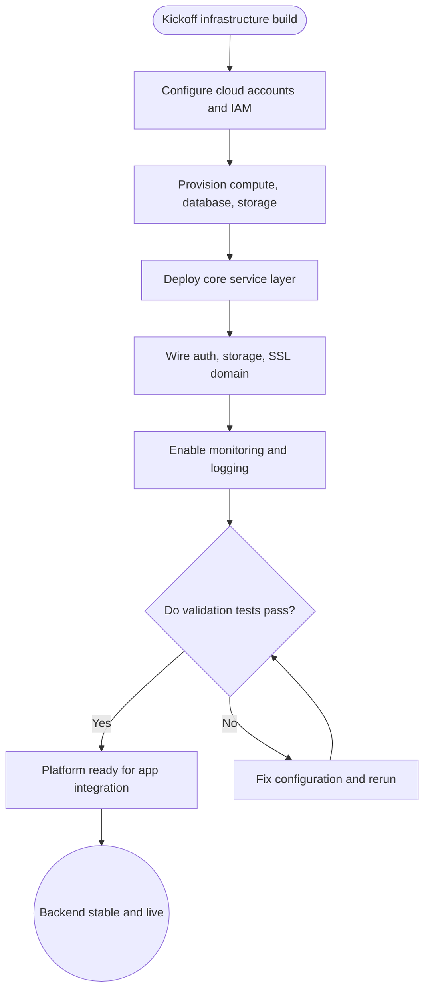

import FeatureSummary from '@site/src/components/FeatureSummary';

# Setup Backend Infrastructure

## One-Glance Summary

<FeatureSummary />

## Narrative
Setup Backend Infrastructure establishes the technical spine that keeps AWATERRA available, secure, and performant. The work bundles provisioning managed services, wiring authentication, and building the foundational APIs that power the first release.

The team brings every core system online in a controlled sequence so mobile clients can reach critical data paths with confidence. Monitoring, logging, and automated backups round out the effort so operations have immediate visibility once the product goes live.

## Interaction Blueprint
1. Configure cloud service accounts and baseline access policies for the environment.
2. Provision compute, database, and storage resources, then prepare the baseline data structures for launch.
3. Deploy the core service layer and expose the essential launch endpoints.
4. Integrate authentication, media storage, and secure domain settings so clients can connect confidently.
5. Enable observability with performance, reliability, and incident dashboards.
6. Run connectivity and load smoke tests across Wi-Fi and cellular profiles, then share monitoring access with operators.

- Edge case: A service comes up without the expected network rules, preventing mobile traffic; revert to the safe policy baseline and retest connectivity before going live.

- Signals of success:
  - Core APIs respond within target thresholds across staged network profiles.
  - Heartbeat monitors stay green with no unauthorised errors during soak tests.
  - Observability dashboards show live traffic and alerting without manual intervention.

### Mermaid Journey IN MERMAID FORMAT

## Requirements & Guardrails
- **Acceptance criteria**
  - GIVEN the production infrastructure WHEN the service layer is live THEN the core user journeys respond successfully and report healthy status signals.
  - GIVEN the launch domain and certificates WHEN users access secure areas of the product THEN the experience remains trusted with no security warnings or broken sessions.
  - GIVEN the observability tooling WHEN platform health slips outside agreed thresholds THEN alerts notify the on-call owner with actionable context.
- **No-gos & risks**
  - Do not expose databases or storage buckets without restricted access policies.
  - Avoid skipping backup configuration or runbook documentation for critical services.
  - Prevent cost spikes by right sizing resources and tagging spend owners from day one.

## Data & Measurement
- Primary metric: API success rate for core endpoints during smoke and load tests (target 99.5 percent or higher).
- Secondary checks: Median response time under 200 ms, error budget burn rate during soak, backup job completion status.
- Telemetry requirements: Track heartbeat uptime, latency percentiles, deployment events, and alert firing in analytics pipelines.

## Open Questions
- Which regions and redundancy tiers do we need at launch to balance latency and cost?
- How will we automate environment parity between staging and production?
- What thresholds should trigger paging for infrastructure incidents?
