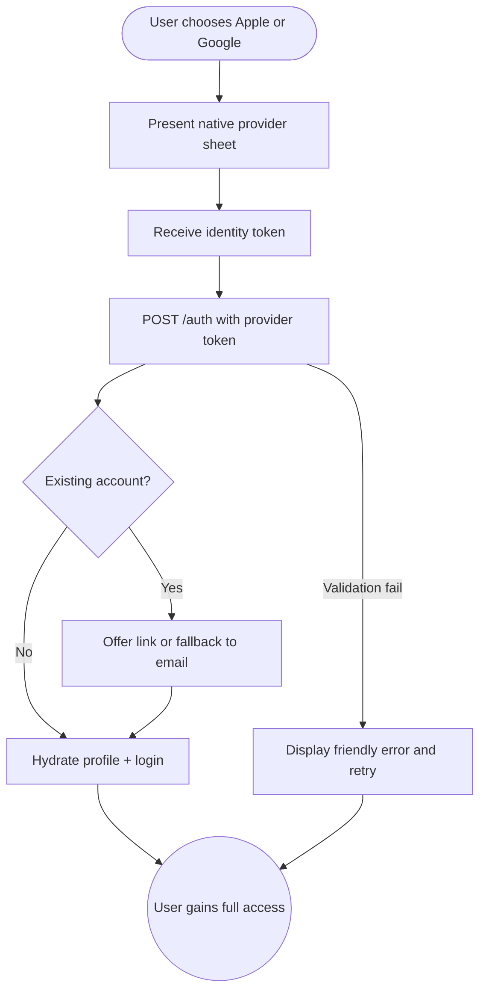

import FeatureSummary from '@site/src/components/FeatureSummary';

# Sign Up with Apple + Google

## Summary

<FeatureSummary />

## Narrative
This feature introduces native Sign in with Apple and Google authentication so new users can commit in seconds without typing passwords. The flows live next to the email path and honor the same privacy and consent standards while letting guests upgrade instantly.

Both providers share an intermediary backend layer that validates tokens, links them to existing email accounts when possible, and handles profile hydration. Reusable helpers, dedicated networking logic, and clear error copy keep the experience predictable across devices.

## Interaction
1. User taps "Sign up with Apple" or "Sign up with Google" from onboarding or the guest banner.
2. Native SDK opens the provider sheet where the user selects accounts and confirms consent.
3. App exchanges the returned identity token via `/auth {apple_token|google_token}` to the intermediary backend.
4. Backend validates the token, checks for an existing AWATERRA account, and links or creates the profile.
5. On success we hydrate profile data, pull display name/avatar, and drop the user into the home experience.
6. If we detect an existing email account we prompt to connect providers so subsequent logins remain seamless.
7. Error states surface friendly guidance plus a retry option, while analytics capture provider, outcome, and latency.

:::caution Edge Case
If the provider sheet succeeds but backend token validation fails, keep the user in-app with a “Could not verify” banner and offer the email sign-up path instead of reopening the provider dialog.
:::

:::tip Signals of Success
- Majority of new accounts complete via Apple or Google without abandoning the flow.
- Returning users see their linked accounts automatically without duplicate profiles.
- Authentication failures drop as helper libraries consolidate handling.
:::

## Journey

## Requirements
- **Acceptance criteria**
  - GIVEN a user completes the Apple or Google sheet WHEN backend validation passes THEN they skip password creation and land on the home screen authenticated.
  - GIVEN the email address already exists WHEN linking THEN the user sees a clear consent dialog before we merge provider credentials.
  - GIVEN provider APIs return an error WHEN we surface it THEN copy includes next steps (retry, email sign-up) and logging captures the provider error code.
- **No-gos & risks**
  - Creating duplicate accounts for the same email increases fraud and data fragmentation.
  - Storing provider tokens beyond the exchange window violates policy.
  - Inconsistent UI between providers erodes trust; use shared components.

## Data
- **Primary metric:** Conversion rate from provider button tap to successful authenticated session.
- **Secondary checks:** Provider-specific error rate, exchange latency, merge completion rate, and retries per user.
- **Telemetry requirements:** Log provider type, token validation outcome, merge state, retry count (without storing tokens), and fallback usage.

## Open Questions
- Do we support "Hide my email" accounts at launch or restrict to full email disclosures?
- Should we surface explicit copy about linking to existing email accounts before or after the provider sheet?
