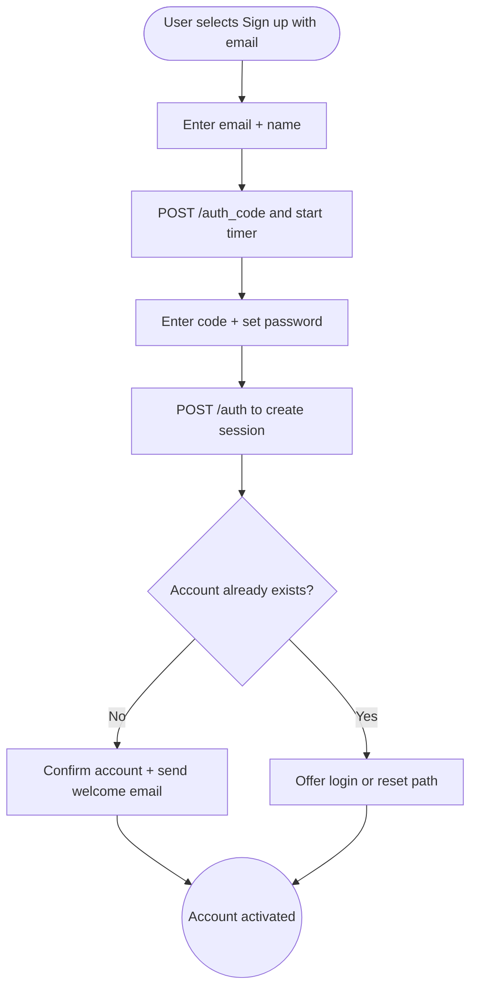

import FeatureSummary from '@site/src/components/FeatureSummary';

# Sign Up with Email

## Summary

<FeatureSummary />

## Narrative
Email sign-up remains the universal fallback for users who prefer not to rely on third-party providers. The flow captures email, password, and verification code within one guided sequence so people understand progress and friction stays low.

We emphasize reliable delivery and resilience: rate-limited code requests, inline validation, timers to prevent spam, and clear privacy copy. Once the code is validated, the backend finalizes the profile and unlocks personalized practices immediately.

## Interaction
1. User enters their email address and optional display name on the first step.
2. Form validates format locally and via `/auth_code {email}` to trigger a verification email containing a one-time code.
3. Timer component counts down the resend window while the user enters the code and sets a password.
4. Client sends `/auth { email, code }` to exchange for a session token plus refresh credentials.
5. On success we finalize onboarding details (timezone, preferences) and drop the user into the personalized home.
6. If the user has a pre-existing account we offer login and password reset options before continuing.
7. Confirmation email recaps the device, time, and security tips.

:::caution Edge Case
If the user closes the app mid-flow, resume at the verification step with the timer intact so codes are not resent unnecessarily.
:::

:::tip Signals of Success
- Verification emails deliver quickly and codes are redeemed on the first attempt.
- Sign-up abandonments drop because validation feedback arrives instantly.
- Support sees fewer "Never got the email" tickets thanks to resend + status messaging.
:::

## Journey

## Requirements
- **Acceptance criteria**
  - GIVEN a valid email WHEN the user requests a code THEN the timer starts, resend stays disabled until it expires, and the email is queued within SLA.
  - GIVEN the user enters the correct code within the allowed window WHEN `/auth` is called THEN they receive a session token and onboarding continues.
  - GIVEN the email already belongs to an account WHEN submission occurs THEN the UI clearly directs the user to log in or reset their password instead of creating duplicates.
- **No-gos & risks**
  - Sending unlimited codes invites abuse; enforce rate limits and captcha when needed.
  - Failing to communicate timer state confuses users about when to expect emails.
  - Storing passwords client-side or in logs is strictly forbidden.

## Data
- **Primary metric:** Conversion rate from email entry to successful account activation.
- **Secondary checks:** Verification email latency, resend rate, duplicate-account intercepts, and timer restarts.
- **Telemetry requirements:** Log hashed domain, request timestamps, verification outcomes, resend counts, abandonment reasons, and resume events.

## Open Questions
- Should we allow passwordless (code-only) activation in a later iteration, or is password creation mandatory for 0.4?
- Do we support localized copy for verification emails at launch?
