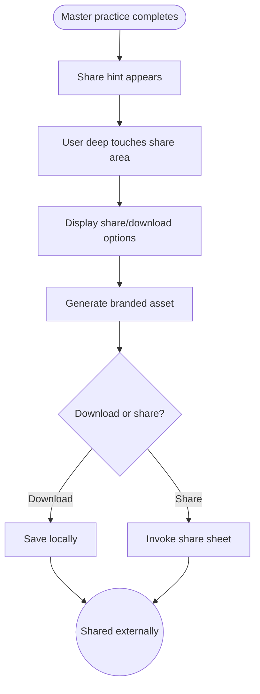

import FeatureSummary from '@site/src/components/FeatureSummary';

# Social Sharing (Paid)

## Summary

<FeatureSummary />

## Narrative
Upon finishing a premium master practice, members can long-press (deep touch) the completion card to reveal sharing options. They can download the animated card, copy curated copy, or share directly to social apps. Assets include geometry, master name, practice quote, and the user’s display name if they opt in.

The goal is to let users celebrate their journey while subtly inviting others to explore AWATERRA.

## Interaction
1. Completion screen shows a subtle “Share” hint.
2. Deep touch or tap opens share tray with options: Save image/GIF, Share to Instagram/Telegram/etc., Copy link.
3. Backend renders the card with dynamic data (practice, reaction, AWAWAY progress) and returns platform-specific aspect ratios.
4. If the user picks download, asset saves locally; if they choose an app, OS share sheet launches.
5. Optional stickers/text overlays allow customization.
6. Shared links include referral codes when applicable.
7. History tab stores recent shares for re-use.

:::caution Edge Case
If the render service is unavailable, fallback to a simplified static card stored locally so the experience never dead-ends.
:::

:::tip Signals of Success
- Share rate from master completions increases, driving referral traffic.
- Assets feel premium and on-brand across platforms.
- No sensitive data leaks; users opt into name display.
:::

## Journey

## Requirements
- **Acceptance criteria**
  - GIVEN a user completes a master practice WHEN they trigger share THEN assets include correct metadata (master, practice, reaction) and respect opt-in for name display.
  - GIVEN they choose a destination WHEN the OS share sheet opens THEN the selected asset attaches with prefilled copy including referral link if available.
  - GIVEN the render service is offline WHEN share is requested THEN the fallback static asset appears with messaging and logs the incident.
- **No-gos & risks**
  - Embedding internal IDs or personal data in shared assets is unacceptable.
  - Missing localized copy will make the card feel off-brand; ensure translations exist.
  - Render times longer than a second ruin the celebratory vibe; keep it fast or allow background prep.

## Data
- **Primary metric:** Share-through rate from master completions.
- **Secondary checks:** Asset render success, downloads per user, referral clicks, customization usage, and fallback frequency.
- **Telemetry requirements:** Log practice ID, asset type, render duration, destination, referral code, errors, and whether static fallback was used.

## Open Questions
- Do we allow video snippets in addition to static/animated cards?
- Should referral codes be optional or always embedded for paid members?
