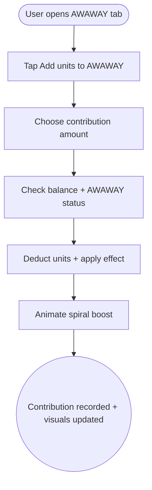

import FeatureSummary from '@site/src/components/FeatureSummary';

# SPEND Add to AWAWAY

## Summary

<FeatureSummary />

## Narrative
Some practitioners want to accelerate their AWAWAY journey or support the system beyond daily practice. “Add to AWAWAY” enables them to spend units to energize the spiral—unlocking visual boosts, extending Field Key effects, or funding communal enhancements tied to the streak narrative.

The experience lives within the AWAWAY tab so intent stays clear: this is not a shortcut that replaces practice, but a contribution that keeps the geometry luminous.

## Interaction
1. User opens the AWAWAY tab and taps “Add units to AWAWAY.”
2. Modal explains what the contribution does (e.g., extend glow, unlock ambient effects) and lists preset amounts.
3. User selects an amount and confirms; ledger deducts units and tags the transaction with AWAWAY metadata.
4. AWAWAY service applies the effect (e.g., highlight the spiral, unlock cosmetic upgrades) without altering streak counts.
5. Confirmation animation shows the spiral brightening, reinforcing impact.
6. Activity history logs the spend for transparency.
7. If the user lacks units, we suggest missions or practices to refill.

:::caution Edge Case
If AWAWAY services are unreachable, block contributions and show “AWAWAY is syncing—try again soon” so we never take units without applying the effect.
:::

:::tip Signals of Success
- Users spend units specifically to enhance AWAWAY surfaces.
- Contributions never replace the requirement to practice; streak integrity remains intact.
- Visual feedback feels meaningful, encouraging repeat use.
:::

## Journey

## Requirements
- **Acceptance criteria**
  - GIVEN a user selects a contribution WHEN balance is sufficient THEN units deduct and AWAWAY visuals update within the session.
  - GIVEN the AWAWAY service is unavailable WHEN the user attempts to contribute THEN the flow blocks gracefully and no units are deducted.
  - GIVEN a contribution completes WHEN the user views history THEN the entry clearly states the amount, date, and effect applied.
- **No-gos & risks**
  - Allowing contributions to replace practices could undermine the streak ethic; keep effects cosmetic or communal.
  - Ambiguous copy might make users think this is a requirement rather than optional support.
  - Taking units without immediate visual payoff erodes trust.

## Data
- **Primary metric:** Number of AWAWAY contributions per active streak user.
- **Secondary checks:** Average contribution size, repeat rate, user sentiment, support tickets referencing unclear effects, and sync failures.
- **Telemetry requirements:** Log amount, balance before/after, effect ID, visual update status, failure reasons, and suggestion modules shown when balance is insufficient.

## Open Questions
- What specific enhancements does a contribution unlock in 0.5 (glow duration, particle effects, Field Key boosters)?
- Should contributions influence community-level visuals (e.g., shared spiral brightness) or stay personal?
