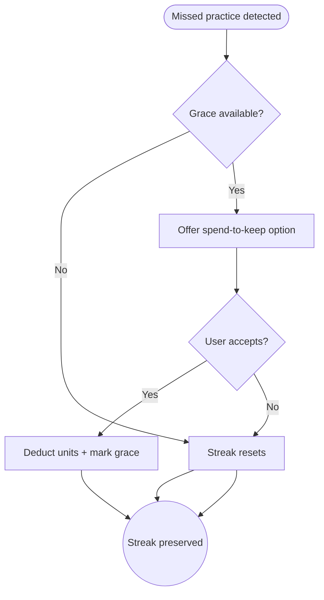

import FeatureSummary from '@site/src/components/FeatureSummary';

# SPEND Units to Not Skip the Streak

## Summary

<FeatureSummary />

## Narrative
Even dedicated practitioners can miss a day. Paid users may spend Lumens to invoke a “grace save” once per defined period, keeping their AWAWAY streak alive. The flow is transparent about cost, cooldown, and impact so it feels like a mindful choice, not a cheat.

## Interaction
1. Scheduler detects a missed day but within the grace eligibility window.
2. App presents a prompt: “Spend X units to keep your streak glowing?” with details on cooldown (e.g., once every 14 days).
3. User confirms; ledger deducts units and AWAWAY service marks the day as preserved.
4. Streak visuals update without incrementing practice count but showing a small “grace” indicator.
5. Cooldown timer starts; UI shows when the next grace will be available.
6. If the user declines, streak resets as usual.
7. History logs the action for transparency.

:::caution Edge Case
If the user attempts to use the feature twice within the cooldown, block the action, explain when it will be available again, and suggest alternative motivation.
:::

:::tip Signals of Success
- Streak retention improves without undermining commitment.
- Users understand constraints and do not feel misled.
- Ledger, AWAWAY, and reminders stay in sync regarding grace state.
:::

## Journey

## Requirements
- **Acceptance criteria**
  - GIVEN a user meets grace criteria WHEN they choose to spend THEN units deduct, streak remains intact, and cooldown is visibly tracked.
  - GIVEN the user already used their grace during cooldown WHEN they attempt again THEN the UI blocks the action and surfaces the next eligible date.
  - GIVEN ledger deduction fails WHEN processing THEN the streak does not update and messaging explains the failure with instructions to retry.
- **No-gos & risks**
  - Unlimited saves would undermine AWAWAY; enforce strict cooldowns and costs.
  - If cooldown info is hidden, users might feel tricked; always show timers.
  - Partial deductions without streak preservation would erode trust; treat as a single transaction.

## Data
- **Primary metric:** Number of streak saves performed per user per month.
- **Secondary checks:** Cooldown violations prevented, satisfaction feedback, correlation with churn reduction, and reminders triggered post-save.
- **Telemetry requirements:** Log streak ID, units spent, grace date, cooldown expiry, success/failure, and decline reasons.

## Open Questions
- How many units should the save cost, and does it scale with cycle depth?
- Do we notify users proactively when a save is available before the streak breaks?
