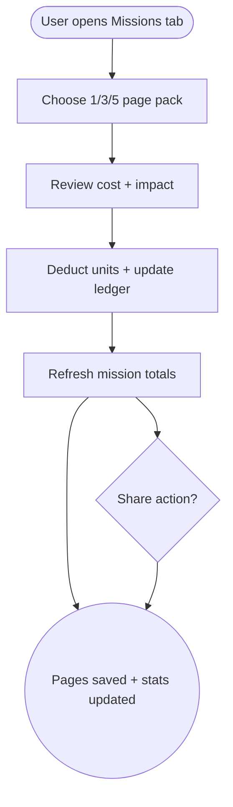

import FeatureSummary from '@site/src/components/FeatureSummary';

# SPEND Rewards Store (Missions)

## Summary

<FeatureSummary />

## Narrative
The Rewards Store transforms Lumens into tangible cultural preservation. Inside the Missions tab users can save ancient manuscript pages by choosing bundles (1, 3, or 5 pages). Copy explains the real-world impact while visuals show the community’s collective progress.

Transactions feel ceremonial: a short confirmation animation, updated statistics, and optional share link (“I just saved 3 pages of wisdom”).

## Interaction
1. User opens Missions and views current campaign (“Save a page of ancient knowledge”).
2. Interface displays bundles (1/3/5 pages) with unit costs and impact statements.
3. User selects a bundle; confirmation modal summarizes cost and new total pages saved.
4. On confirm, ledger deducts units, updates mission totals, and logs the transaction in history.
5. Confirmation screen thanks the user, shows new community progress, and offers share options.
6. Mission dashboard updates in real time for all users.
7. If ledger declines (insufficient units), UI suggests earning actions.

:::caution Edge Case
If mission stats API fails, allow the spend but queue the visualization update, showing a "Stats will refresh soon" banner to avoid double counting.
:::

:::tip Signals of Success
- Users convert stored units into mission contributions regularly.
- Community stats rise steadily with minimal manual intervention.
- Share copy spreads organically, amplifying the mission.
:::

## Journey

## Requirements
- **Acceptance criteria**
  - GIVEN a user selects a pack WHEN they confirm THEN units deduct, mission totals increment, and history logs the action with campaign metadata.
  - GIVEN ledger declines due to insufficient units WHEN the user attempts to spend THEN the UI surfaces helpful earning suggestions instead of failing silently.
  - GIVEN the mission stats endpoint is temporarily unavailable WHEN the spend succeeds THEN users still see confirmation plus a note that stats will refresh later.
- **No-gos & risks**
  - Spending without clear impact messaging will feel hollow; always show what the contribution achieved.
  - Mission progress must be tamper-proof; audit every transaction.
  - Avoid overwhelming users with too many simultaneous campaigns in 0.5.

## Data
- **Primary metric:** AWAWAY Units spent on missions per active user.
- **Secondary checks:** Average pack size, share rate, mission stat freshness, refund incidence, and stat-sync fallbacks.
- **Telemetry requirements:** Log campaign ID, pack size, pre/post unit balance, transaction status, fallback banners, and share actions.

## Open Questions
- Do we rotate missions automatically or require manual activation each cycle?
- Should missions support recurring contributions or stay single-purchase for Glow?
